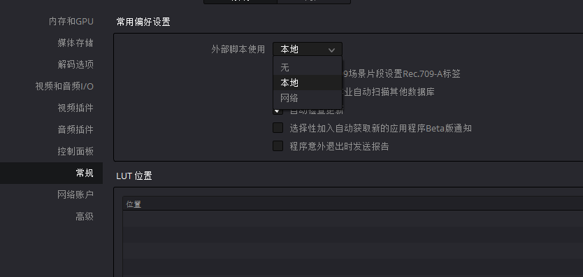

# 概述

与Blackmagic Design Fusion脚本一样，支持使用Lua和Python编程语言编写的用户脚本。默认情况下，可以从Fusion页面的Console窗口调用脚本或者通过命令行。

# 外部脚本使用权限配置

此权限可以在 **偏好设置->常规** 中更改。

- 无
- 本地：只能从控制台更改，也可以从本地网络调用
- 网络：允许从外部网络调用，该选项会有安全问题

# 环境要求

DaVinci Resolve 脚本允许环境要求安装以下之一（适用于所有用户）：

- Lua 5.1 （自带）
- Python2.7 64位
- Python 3.6 64位
