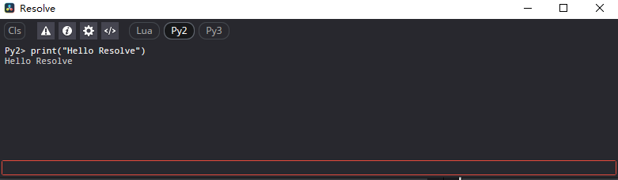
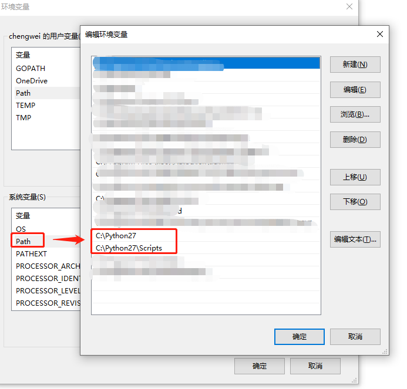
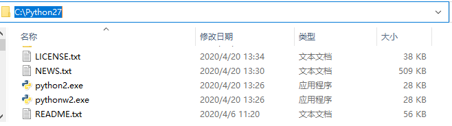
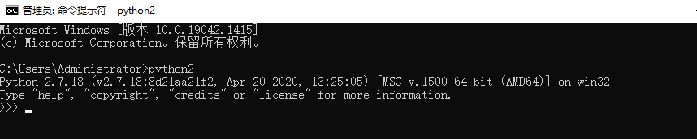
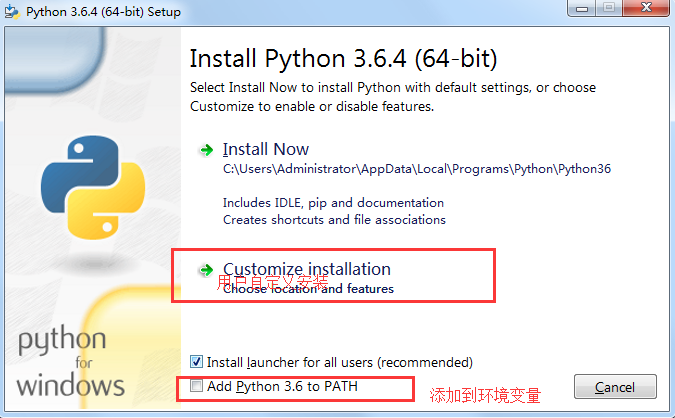
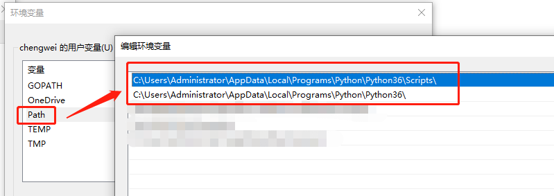
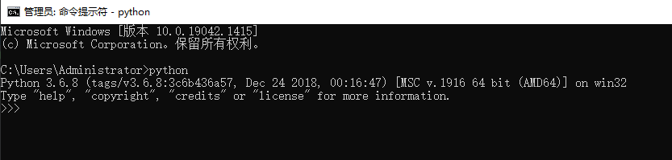
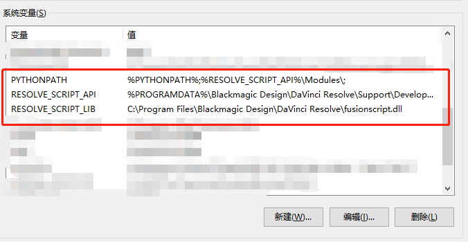

# 概述

与Blackmagic Design Fusion脚本一样，支持使用Lua和Python编程语言编写的用户脚本。默认情况下，可以从Fusion页面的Console窗口调用脚本或者通过命令行。

> 以下文档基于 **Davinci Resolve Studio 17.4**
>
> 注意: Davinci Resolve 免费版不支持开发接口

## 外部脚本使用权限配置

此权限可以在 **偏好设置->常规** 中更改。

- 无
- 本地：只能从控制台更改，也可以从本地网络调用
- 网络：允许从外部网络调用，该选项会有安全问题


## 脚本环境要求

DaVinci Resolve 脚本允许环境要求安装以下之一（适用于所有用户）：

- Lua 5.1 （自带）
- Python2.7 64位
- Python 3.6 64位



## Python2.7 安装

这里只以 windows 10 环境做展示。

**1. 下载**

> https://www.python.org/ftp/python/2.7.18/python-2.7.18.amd64.msi

**2. 安装**

全部默认安装即可

**3. 添加环境变量**



**4. 改名运行程序**

当前主流为 python3 运行环境，这里我们把 python.exe 和 pythonw.exe 重命名为 python2.exe 和 pythonw2.exe





## Python3.6 安装

这里只以 windows 10 环境做展示。

**1. 下载**

> https://www.python.org/ftp/python/3.6.8/python-3.6.8-amd64.exe

**2. 安装**

手动勾选 "Add_Python 3.6 to PATH"，其他全部默认安装即可



**3. 检查环境变量**

如下图所示为正常添加了环境变量安装，如果没有可以手动添加。





## Davinci Resolve 环境变量

- 需要运行DaVinci Resolve Studio才能调用脚本。
- 要从外部文件夹执行解析脚本，脚本需要知道API的位置。

您可能需要设置这些环境变量，以便Python安装能够选择适当的依赖项，如下所示：

### Windows:

```
RESOLVE_SCRIPT_API="%PROGRAMDATA%\Blackmagic Design\DaVinci Resolve\Support\Developer\Scripting"
RESOLVE_SCRIPT_LIB="C:\Program Files\Blackmagic Design\DaVinci Resolve\fusionscript.dll"
PYTHONPATH="%PYTHONPATH%;%RESOLVE_SCRIPT_API%\Modules\"
```



### Mac OS X:

```
 RESOLVE_SCRIPT_API="/Library/Application Support/Blackmagic Design/DaVinci Resolve/Developer/Scripting"
 RESOLVE_SCRIPT_LIB="/Applications/DaVinci Resolve/DaVinci Resolve.app/Contents/Libraries/Fusion/fusionscript.so"
 PYTHONPATH="$PYTHONPATH:$RESOLVE_SCRIPT_API/Modules/"
```

### Linux:

```
RESOLVE_SCRIPT_API="/opt/resolve/Developer/Scripting"
RESOLVE_SCRIPT_LIB="/opt/resolve/libs/Fusion/fusionscript.so"
PYTHONPATH="$PYTHONPATH:$RESOLVE_SCRIPT_API/Modules/"
```

> （注意：对于标准ISO Linux安装，可能需要修改上面的路径改成 /home/resolve 而不是 /opt/resolve）