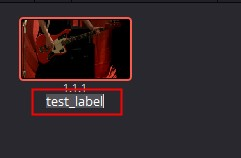

# GalleryStillAlbum对象

## 获取GalleryStillAlbum对象

| 方法                              | 说明                        |
|---------------------------------|---------------------------|
| Gallery.GetCurrentStillAlbum()  | 返回 GalleryStillAlbum 对象   |
| Gallery.GetGalleryStillAlbums() | 返回 GalleryStillAlbum 对象列表 |

```python
import DaVinciResolveScript as dvr_script

resolve = dvr_script.scriptapp("Resolve")

# 获取 ProjectManager 对象
project_manager = resolve.GetProjectManager()

# 获取当前项目返回 project 对象
project = project_manager.GetCurrentProject()

# 获取Gallery对象
gallery = project.GetGallery()

# 获取GalleryStillAlbum对象
gallery_still_album = gallery.GetCurrentStillAlbum()

```

## GalleryStillAlbum.GetStills()

- 返回 [galleryStill]

返回album中GalleryStill对象的列表。

```python
# return [galleryStill]
gallery_stills = gallery_still_album.GetStills()
```

## GalleryStillAlbum.GetLabel(galleryStill)

- 返回 string

返回galleryStill的标签。



```python
# return string
gallery_stills = gallery_still_album.GetStills()
for gallery_still in gallery_stills:
    label = gallery_still_album.GetLabel(gallery_still)
```

## GalleryStillAlbum.GetLabel(galleryStill, label)

- 返回 Bool

设置galleryStill的标签。

```python
# return Bool
gallery_stills = gallery_still_album.GetStills()
for gallery_still in gallery_stills:
    res = gallery_still_album.SetLabel(gallery_still, "test_new_label")
```

## GalleryStillAlbum.ExportStills([galleryStill], folderPath, filePrefix, format)

- 返回 Bool

使用文件格式“format”（支持的格式：dpx、cin、tif、jpg、png、ppm、bmp、xpm）将GalleryStill对象“[galleryStyl]”的列表导出到目录“folderPath”，文件名前缀为“filePrefix”。

```python
# return Bool
gallery_stills = gallery_still_album.GetStills()
res = gallery_still_album.ExportStills(gallery_stills, "E:\\DaVinci\\add_media", "to_", "jpg")  
```

## GalleryStillAlbum.DeleteStills([galleryStill])

- 返回 Bool

删除GalleryStill对象“[galleryStyl]”的指定列表。

```python
# return Bool
gallery_stills = gallery_still_album.GetStills()
res = gallery_still_album.DeleteStills(gallery_stills)  
```

