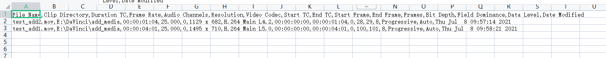

# MediaPool对象

## 获取MediaPool对象

| 方法                     | 说明              |
|------------------------|-----------------|
| Project.GetMediaPool() | 获取 MediaPool 对象 |

```python
import DaVinciResolveScript as dvr_script

resolve = dvr_script.scriptapp("Resolve")

# 获取 ProjectManager 对象
project_manager = resolve.GetProjectManager()

# 获取当前项目返回 project 对象
project = project_manager.GetCurrentProject()

# 获取 MediaPool 对象
media_pool = project.GetMediaPool()
```

## MediaPool.GetRootFolder()

- 返回 Folder

返回媒体池的根文件夹对象。

```python
# return Folder
folder = media_pool.GetRootFolder()
```

## MediaPool.AddSubFolder(folder, name)

- 返回 Folder

在具有给定名称的指定文件夹对象下添加新的子文件夹，并返回该文件夹对象。

```python
# return Folder
folder = media_pool.GetRootFolder()
sub_folder = media_pool.AddSubFolder(folder, "test_sub_folder")
```

## MediaPool.CreateEmptyTimeline(name)

- 返回 Folder

添加具有给定名称的新时间线。返回 Timeline 对象。

```python
# return Timeline
timeline = media_pool.CreateEmptyTimeline("new_test_timeline")
```

## MediaPool.AppendToTimeline(clip1, clip2, ...)

- 返回 [TimelineItem]

在当前时间线中追加指定的MediaPoolItem对象。返回附加的timelineItems对象列表。

```python
# return [TimelineItem]
media_storage = resolve.GetMediaStorage()
item_list = media_storage.AddItemListToMediaPool(
    ["E:\\DaVinci\\add_media\\test_add1.mov", "E:\\DaVinci\\add_media\\test_add2.mov"])
timeline_list = media_pool.AppendToTimeline(item_list[0])
```

## MediaPool.AppendToTimeline([clips])

- 返回 [TimelineItem]

在当前时间线中追加指定的MediaPoolItem对象列表。返回附加的timelineItems对象列表。

```python
# return [TimelineItem]
media_storage = resolve.GetMediaStorage()
item_list = media_storage.AddItemListToMediaPool(
    ["E:\\DaVinci\\add_media\\test_add1.mov", "E:\\DaVinci\\add_media\\test_add2.mov"])
timeline_list = media_pool.AppendToTimeline(item_list)
```

## MediaPool.AppendToTimeline([{clipInfo}, ...])

- 返回 [TimelineItem]

在当前时间线中追加指定的MediaPoolItem对象列表,
附加指定为“mediaPoolItem”、“startFrame”（int）、“endFrame”（int），（可选）“mediaType”（int；1-仅视频，2-仅音频）剪辑字典列表数据。返回附加的timelineItems的列表。

### {clipInfo} 参数说明

| 字段            | 类型     | 说明               |
|---------------|--------|------------------|
| mediaPoolItem | object | 单个媒体池对象          |
| startFrame    | int    | 起始帧              |
| endFrame      | int    | 结束帧              |
| mediaType     | int    | 可选项， 1 仅视频 2 仅音频 |

```python
# return [TimelineItem]
project = project_manager.GetCurrentProject()
media_storage = resolve.GetMediaStorage()

item_list = media_storage.AddItemListToMediaPool(
    ["E:\\DaVinci\\add_media\\test_add1.mov", "E:\\DaVinci\\add_media\\test_add2.mov"])
if len(item_list) > 0:
    media_pool = project.GetMediaPool()
    res = media_pool.AppendToTimeline([{
        'mediaPoolItem': item_list[0],
        'startFrame': 1,
        'endFrame': 10,
        'mediaType': 1
    }])
```

## MediaPool.CreateTimelineFromClips(name, clip1, clip2, ...)

- 返回 Timeline

创建指定名称的新时间线，并附加指定的MediaPoolItem对象。

```python
# return Timeline
media_storage = resolve.GetMediaStorage()
item_list = media_storage.AddItemListToMediaPool(
    ["E:\\DaVinci\\add_media\\test_add1.mov", "E:\\DaVinci\\add_media\\test_add2.mov"])
timeline_list = media_pool.CreateTimelineFromClips("new_timeline", item_list[0], item_list[1])
```

## MediaPool.CreateTimelineFromClips(name, [clips])

- 返回 Timeline

创建指定名称的新时间线，并附加指定的MediaPoolItem对象。

```python
# return Timeline
media_storage = resolve.GetMediaStorage()
item_list = media_storage.AddItemListToMediaPool(
    ["E:\\DaVinci\\add_media\\test_add1.mov", "E:\\DaVinci\\add_media\\test_add2.mov"])
timeline_list = media_pool.CreateTimelineFromClips("new_timeline", item_list)
```

## MediaPool.CreateTimelineFromClips(name, [{clipInfo}, ...])

- 返回 Timeline

创建指定名称的新时间线，附加指定为“mediaPoolItem”、“startFrame”（int）、“endFrame”（int），（可选）“mediaType”（int；1-仅视频，2-仅音频）剪辑字典列表数据。

### {clipInfo} 参数说明

| 字段            | 类型     | 说明               |
|---------------|--------|------------------|
| mediaPoolItem | object | 单个媒体池对象          |
| startFrame    | int    | 起始帧              |
| endFrame      | int    | 结束帧              |
| mediaType     | int    | 可选项， 1 仅视频 2 仅音频 |

```python
# return Timeline
project = project_manager.GetCurrentProject()
media_storage = resolve.GetMediaStorage()

item_list = media_storage.AddItemListToMediaPool(
    ["E:\\DaVinci\\add_media\\test_add1.mov", "E:\\DaVinci\\add_media\\test_add2.mov"])
if len(item_list) > 0:
    media_pool = project.GetMediaPool()
    res = media_pool.CreateTimelineFromClips("new_timeline", [{
        'mediaPoolItem': item_list[0],
        'startFrame': 1,
        'endFrame': 10,
        'mediaType': 1
    }])
```

## MediaPool.ImportTimelineFromFile(filePath, {importOptions})

- 返回 Timeline

基于给定文件和导入选项字典中的参数创建时间线。

### {importOptions} 参数说明

| 字段                  | 类型     | 说明                                                      |
|---------------------|--------|---------------------------------------------------------|
| timelineName        | string | 时间线名称                                                   |
| importSourceClips   | Bool   | 是否从系统文件夹搜索导入媒体，默认为True                                  |
| sourceClipsPath     | string | 指定一个系统文件路径，当媒体在其原始路径中不可访问且“importSourceClips”为True时搜索   |
| sourceClipsFolders  | List   | 指定一个媒体池文件夹对象列表，当媒体不在当前文件夹中且“importSourceClips”为False时搜索 |
| interlaceProcessing | Bool   | 指定是否在正在创建的导入时间线上启用隔行扫描处理。仅对AAF导入有效                      |

```python
# return Timeline
project = project_manager.GetCurrentProject()
media_pool = project.GetMediaPool()

res = media_pool.ImportTimelineFromFile("E:\\DaVinci\\timeline\\layout.edl", {
    "timelineName": "import_timeline_test",
    "importSourceClips": True,
    "sourceClipsPath": "E:\\DaVinci\\add_media\\"
})
```

## MediaPool.DeleteTimelines([timeline])

- 返回 Bool

从媒体池删除指定的时间线对象

```python
# return Bool
timeline = project.GetCurrentTimeline()
res = media_pool.DeleteTimelines([timeline])
```

## MediaPool.GetCurrentFolder()

- 返回 Folder

返回当前选择的文件夹对象

```python
# return Folder
folder = media_pool.GetCurrentFolder()
```

## MediaPool.SetCurrentFolder(Folder)

- 返回 Bool

按给定文件夹对象设置当前文件夹。

```python
# return Bool
folder = media_pool.GetRootFolder()
res = media_pool.SetCurrentFolder(folder)
```

## MediaPool.DeleteClips([clips])

- 返回 Bool

删除媒体池中指定的剪辑片段或时间线蒙版。

```python
# return Bool
folder = media_pool.GetCurrentFolder()
clips = folder.GetClipList()
res = media_pool.DeleteClips(clips)
```

## MediaPool.DeleteFolders([subfolders])

- 返回 Bool

删除媒体池中指定的子文件夹，根文件夹无法被删除。

```python
# return Bool
folder = media_pool.GetCurrentFolder()
res = media_pool.DeleteFolders([folder])
```

## MediaPool.MoveClips([clips], targetFolder)

- 返回 Bool

将指定剪辑片段移动到目标文件夹。

```python
# return Bool
folder = media_pool.GetCurrentFolder()
clips = folder.GetClipList()
targetFolder = media_pool.GetRootFolder()
res = media_pool.DeleteFolders(clips, targetFolder)
```

## MediaPool.MoveFolders([folders], targetFolder)

- 返回 Bool

将指定文件夹移动到目标文件夹。

```python
# return Bool
folder = media_pool.GetCurrentFolder()
res = media_pool.DeleteFolders([folder], targetFolder)
```


## MediaPool.GetClipMatteList(MediaPoolItem) 

- 返回 [paths] 

获取指定MediaPoolItem的蒙版，返回蒙版文件的路径列表。

```python
# return [paths] 
media_storage = resolve.GetMediaStorage()
item_list = media_storage.AddItemListToMediaPool(
    ["E:\\DaVinci\\add_media\\test_add1.mov", "E:\\DaVinci\\add_media\\test_add2.mov"])
paths_list = media_pool.GetClipMatteList(item_list[0])
```

## MediaPool.GetTimelineMatteList(Folder)

- 返回 [MediaPoolItems]

获取指定文件夹中的蒙版，返回MediaPoolItems对象列表。

```python
# return [MediaPoolItems]
folder = media_pool.GetCurrentFolder()
media_pool_item_list = media_pool.GetTimelineMatteList(folder)
```

## MediaPool.DeleteClipMattes(MediaPoolItem, [paths])

- 返回 Bool

根据指定MediaPoolItem的文件路径删除蒙版。成功时返回True。

```python
# return Bool
folder = media_pool.GetCurrentFolder()
media_pool_item_list = media_pool.GetTimelineMatteList(folder)
media_storage = resolve.GetMediaStorage()
item_list = media_storage.AddItemListToMediaPool(
    ["E:\\DaVinci\\add_media\\test_add1.mov", "E:\\DaVinci\\add_media\\test_add2.mov"])
paths_list = media_pool.GetClipMatteList(item_list[0])

res = media_pool.DeleteClipMattes(media_pool_item_list[0], media_pool_item_list)
```

## MediaPool.RelinkClips([MediaPoolItem], folderPath)

- 返回 Bool

使用指定的文件夹路径更新指定媒体池剪辑的文件夹位置。

```python
# return Bool
folder = media_pool.GetCurrentFolder()
media_pool_item_list = media_pool.GetTimelineMatteList(folder)
res = media_pool.RelinkClips(media_pool_item_list, "E:\\DaVinci\\add_media\\")
```

## MediaPool.UnlinkClips([MediaPoolItem]) 

- 返回 Bool

取消指定媒体池剪辑的链接。

```python
# return Bool
folder = media_pool.GetCurrentFolder()
media_pool_item_list = media_pool.GetTimelineMatteList(folder)
res = media_pool.UnlinkClips(media_pool_item_list)
```

## MediaPool.ImportMedia([items...])

- 返回 [MediaPoolItems]

将指定的文件/文件夹路径导入当前媒体池文件夹，输入是文件/文件夹路径的数组。返回创建的MediaPoolItems的列表。

```python
# return [MediaPoolItems]
res = media_pool.ImportMedia(["E:\\DaVinci\\add_media\\test_add1.mov", "E:\\DaVinci\\add_media\\test_add2.mov"])
```

## MediaPool.ImportMedia([{clipInfo}])

- 返回 [MediaPoolItems]

按照指定的文件路径的clipInfo字典列表数据导入当前媒体池文件夹。返回创建的媒体池项目列表。

除非启用“显示单个帧”，否则每个clipInfo将作为一个MediaPoolItem导入。

| 字段         | 类型     | 说明      |
|------------|--------|---------|
| FilePath   | string | 文件路径    |
| StartIndex | index  | 序列帧起始索引 |
| EndIndex   | index  | 序列帧结束索引 |

```python
# return [MediaPoolItems]
res = media_pool.ImportMedia([{"FilePath":"file_%03d.dpx", "StartIndex":1, "EndIndex":100}])
```

## MediaPool.ExportMetadata(fileName, [clips])

- 返回 Bool

将指定剪辑的元数据导出为CSV格式的“文件名”。如果未指定剪辑，则将使用媒体池中的所有剪辑片段。

> 注意 指定路径下面如果 fileName 存在则会导出失败

```python
# return Bool
folder = media_pool.GetCurrentFolder()
clips = folder.GetClipList()
res = media_pool.ExportMetadata("E:\\DaVinci\\csv\\test_csv.csv", clips)
```

### 导出数据示例


