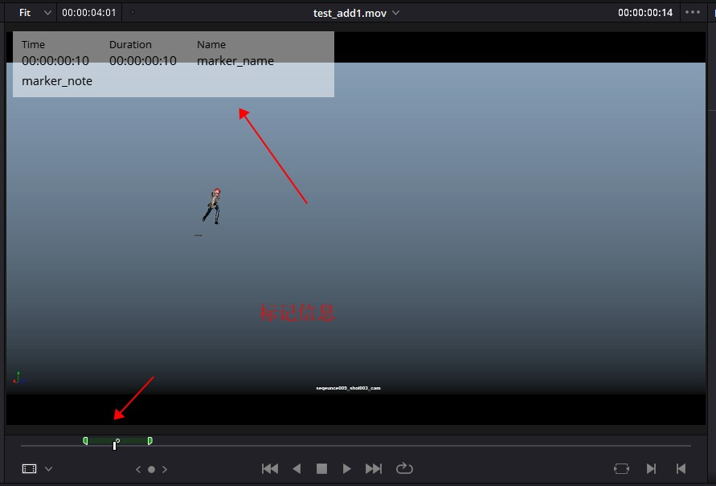

# MediaPoolItems对象

## 获取MediaPoolItem对象

| 方法                                                 | 说明                                                 |
|----------------------------------------------------|----------------------------------------------------|
| MediaStorage.AddTimelineMattesToMediaPool([paths]) | 将指定的媒体文件添加为当前媒体池文件夹中的时间线蒙版,返回已创建的MediaPoolItems的列表 |
| MediaPool.GetTimelineMatteList(Folder)             | 获取指定文件夹中的蒙版，作为MediaPoolItems列表                     |
| MediaPool.ImportMedia([items...])                  | 将指定的文件/文件夹路径导入当前媒体池文件夹，返回创建的MediaPoolItems的列表      |
| MediaPool.ImportMedia([{clipInfo}])                | 将指定的文件/文件夹路径导入当前媒体池文件夹，返回创建的MediaPoolItems的列表      |

```python
import DaVinciResolveScript as dvr_script

resolve = dvr_script.scriptapp("Resolve")

project_manager = resolve.GetProjectManager()
project = project_manager.GetCurrentProject()

media_pool = project.GetMediaPool()
media_pool_items = media_pool.ImportMedia(["E:\\DaVinci\\add_media\\test_add1.mov", "E:\\DaVinci\\add_media\\test_add2.mov"])

for media_pool_item in media_pool_items:
    print(media_pool_item)
```

## MediaPoolItem.GetName()

- 返回 string

返回剪辑名称。

```python
# return string
name = media_pool_item.GetName()
```

## MediaPoolItem.GetMetadata(metadataType=None) 

- 返回 string|dict

返回键“metadataType”的元数据值。

```python
# return string|dict
# 不填metadataType类型默认返回所有元数据
metadata = media_pool_item.GetMetadata()

# 填写指定的metadataType类型默认返回其元数据
metadata = media_pool_item.GetMetadata("Keywords")
```

## MediaPoolItem.SetMetadata(metadataType, metadataValue)

- 返回 Bool

将给定的元数据设置为metadataValue（string）。如果成功，则返回True。

```python
# return Bool
res = media_pool_item.SetMetadata("Keywords", "test2,test3")
```

## MediaPoolItem.SetMetadata({metadata})

- 返回 Bool

将给定的元数据字典设置为元数据。如果成功，则返回True。

```python
# return Bool
res = media_pool_item.SetMetadata({'Keywords': 'test2,test3'})
```

## MediaPoolItem.GetMediaId()

- 返回 string

返回 MediaPoolItem 的唯一UUID。

```python
# return string
media_pool_item_id = media_pool_item.GetMediaId()
```

## MediaPoolItem.AddMarker(frameId, color, name, note, duration,customData)

- 返回 Bool

在给定的frameId位置使用给定的标记信息创建新标记。'customData”是可选的，有助于将用户特定数据附加到标记。

| 参数         | 说明                                                                                                                                                             |
|------------|----------------------------------------------------------------------------------------------------------------------------------------------------------------|
| frameId    | 起始帧，单位为帧                                                                                                                                                       |
| color      | 颜色 蓝色（Blue）,青色（Cyan），绿色（Green），黄色（Yellow），红色（Red），粉色（Pink），紫色（Purple），紫红（Fuchsia），玫红（Rose），淡紫（Lavender），淡蓝（Sky），亮绿（Mint），亮黄（Lemon），金色（Sand），深棕（Sand），乳白（Cream） |
| name       | 标记名称                                                                                                                                                           |
| note       | 标记描述                                                                                                                                                           |
| duration   | 标记持续时间，单位为帧                                                                                                                                                    |
| customData | 自定义数据，字符串类型，可以写入json字符串                                                                                                                                        |




```python
# return Bool
res = media_pool_item.AddMarker(100.0, "Green", "marker_name", "marker_note", 100.0, "test_custom_data")
```

## MediaPoolItem.GetMarkers()

- 返回 {markers...}

返回所有标记id和标记字典数据，返回字典格式为（frameId->{information}）。

```python
# return {markers...}
media_pool_item_markers = media_pool_item.GetMarkers()
```

## MediaPoolItem.GetMarkerByCustomData(customData)

- 返回 {markers...}

返回具有指定customData的第一个匹配标记的标记{information}。

```python
# return {markers...}
media_pool_item_marker = media_pool_item.GetMarkerByCustomData("test_custom_data")
```

## MediaPoolItem.UpdateMarkerCustomData(frameId, customData)

- 返回 Bool

更新给定frameId位置处标记的customData（字符串）。CustomData不通过UI公开，对于脚本开发人员将任何特定于用户的数据附加到标记很有用。

```python
# return Bool
res = media_pool_item.UpdateMarkerCustomData(10.0, "test_custom_data2")
```

## MediaPoolItem.GetMarkerCustomData(frameId)

- 返回 string

返回给定frameId位置处标记的customData字符串。

```python
# return string
customData = media_pool_item.GetMarkerCustomData(100.0)
```

## MediaPoolItem.DeleteMarkersByColor(color)

- 返回 Bool

删除指定颜色的所有时间线标记。支持“All”参数并删除所有时间线标记。

| 参数       | 说明         |
|----------|------------|
| All      | 删除所有标记点    | 
| Blue     | 删除所有蓝色标记点  | 
| Cyan     | 删除所有青色标记点  | 
| Green    | 删除所有绿色标记点  | 
| Yellow   | 删除所有黄色标记点  | 
| Red      | 删除所有红色标记点  | 
| Pink     | 删除所有粉色标记点  | 
| Purple   | 删除所有紫色标记点  | 
| Fuchsia  | 删除所有紫红色标记点 | 
| Rose     | 删除所有玫红色标记点 | 
| Lavender | 删除所有淡紫色标记点 | 
| Sky      | 删除所有淡蓝色标记点 | 
| Mint     | 删除所有亮绿色标记点 | 
| Lemon    | 删除所有亮黄色标记点 | 
| Sand     | 删除所有金色色标记点 | 
| Sand     | 删除所有深棕色标记点 | 
| Cream    | 删除所有乳白色标记点 | 

```python
# return Bool
res = media_pool_item.DeleteMarkersByColor("All")
```

## MediaPoolItem.DeleteMarkerAtFrame(frameNum)

- 返回 Bool

删除给定帧编号处的时间线标记。

```python
# return Bool
res = media_pool_item.DeleteMarkerAtFrame(86400)
```

## MediaPoolItem.DeleteMarkerByCustomData(customData)

- 返回 Bool

删除具有指定customData的第一个匹配标记。

```python
# return Bool
res = media_pool_item.DeleteMarkerByCustomData("test_tag2")
```

## MediaPoolItem.AddFlag(color)

- 返回 Bool

添加具有给定颜色的标志（字符串）。 

```python
# return Bool
res = media_pool_item.AddFlag("Blue")
```

## MediaPoolItem.GetFlagList()

- 返回 [colors...]

返回分配给项目的标志颜色列表。

```python
# return [colors...]
color_list = media_pool_item.GetFlagList()
```

## MediaPoolItem.ClearFlags(color)

- 返回 Bool

清除给定颜色的标志（如果存在）。支持“All”参数并清除所有标志。

```python
# return Bool
res = media_pool_item.ClearFlags("Blue")
```

## MediaPoolItem.GetClipColor()

- 返回 string

以字符串形式返回项目颜色，元数据里面设置的参数。

```python
# return string
color = media_pool_item.GetClipColor()
```

## MediaPoolItem.SetClipColor(colorName) 

- 返回 Bool

基于colorName（字符串）设置项目颜色。

```python
# return Bool
res = media_pool_item.SetClipColor("Lime")
```

## MediaPoolItem.ClearClipColor() 

- 返回 Bool

清除项目颜色。

```python
# return Bool
res = media_pool_item.ClearClipColor()
```

## MediaPoolItem.GetClipProperty(propertyName=None)

- 返回 string|dict

返回键“propertyName”的属性值。
如果未指定参数，则返回所有剪辑属性的dict。有关详propertyName细信息，请查看全部数据。

```json
{
	'Alpha mode': 'None',
	'Angle': '',
	'Audio Bit Depth': '',
	'Audio Ch': '0',
	'Audio Codec': '',
	'Audio Offset': '',
	'Bit Depth': '8',
	'Camera #': '',
	'Clip Color': '',
	'Clip Name': 'test_add2.mov',
	'Comments': '',
	'Data Level': 'Auto',
	'Date Added': 'Tue Oct 18 2022 15:28:07',
	'Date Created': 'Sat Jan 8 2022 10:24:38',
	'Date Modified': 'Thu Jul  8 09:57:14 2021',
	'Description': '',
	'Drop frame': '0',
	'Duration': '00:00:01:04',
	'Enable Deinterlacing': '0',
	'End': '28',
	'End TC': '00:00:01:04',
	'FPS': 25.0,
	'Field Dominance': 'Auto',
	'File Name': 'test_add2.mov',
	'File Path': 'E:\\DaVinci\\add_media\\test_add2.mov',
	'Flags': '',
	'Format': 'QuickTime',
	'Frames': '29',
	'Good Take': '',
	'H-FLIP': 'Off',
	'IDT': '',
	'In': '',
	'Input Color Space': 'Rec.709 (Scene)',
	'Input LUT': '',
	'Input Sizing Preset': 'None',
	'Keyword': 'test2,test4',
	'Noise Reduction': '',
	'Offline Reference': '',
	'Out': '',
	'PAR': 'Square',
	'Proxy': 'None',
	'Proxy Media Path': '',
	'Reel Name': '',
	'Resolution': '1129x682',
	'Roll/Card': '',
	'S3D Sync': '',
	'Sample Rate': '',
	'Scene': '',
	'Sharpness': '',
	'Shot': '',
	'Slate TC': '00:00:00:00',
	'Start': '0',
	'Start KeyKode': '',
	'Start TC': '00:00:00:00',
	'Synced Audio': '',
	'Take': '',
	'Type': 'Video',
	'Usage': '0',
	'V-FLIP': 'Off',
	'Video Codec': 'H.264 Main L4.2',
	'Super Scale': 1
}
```

```python
# return string|dict
# 返回剪辑项全部属性字典
item_property = media_pool_item.GetClipProperty()
# 返回 Alpha mode 属性值
item_property = media_pool_item.GetClipProperty("Alpha mode")
```

## MediaPoolItem.SetClipProperty(propertyName, propertyValue)

- 返回 Bool

将给定属性设置为propertyValue（string）。

```python
# return Bool
res = media_pool_item.SetClipProperty("Alpha mode", "Premultiplied")
```

## MediaPoolItem.LinkProxyMedia(proxyMediaFilePath)

- 返回 Bool

将位于参数“proxyMediaFilePath”指定路径的代理媒体与当前剪辑链接proxyMediaFilePath应为绝对剪辑路径。

```python
# return Bool
res = media_pool_item.LinkProxyMedia("E:\\DaVinci\\add_media\\test_add.mov")
```

## MediaPoolItem.UnlinkProxyMedia()

- 返回 Bool

取消链接与剪辑关联的任何代理媒体。

```python
# return Bool
res = media_pool_item.UnlinkProxyMedia()
```

## MediaPoolItem.ReplaceClip(filePath)

- 返回 Bool

用指定的绝对剪辑路径替换MediaPoolItem的基础资源和元数据。

```python
# return Bool
res = media_pool_item.ReplaceClip("E:\\DaVinci\\add_media\\test_add.mov")
```
