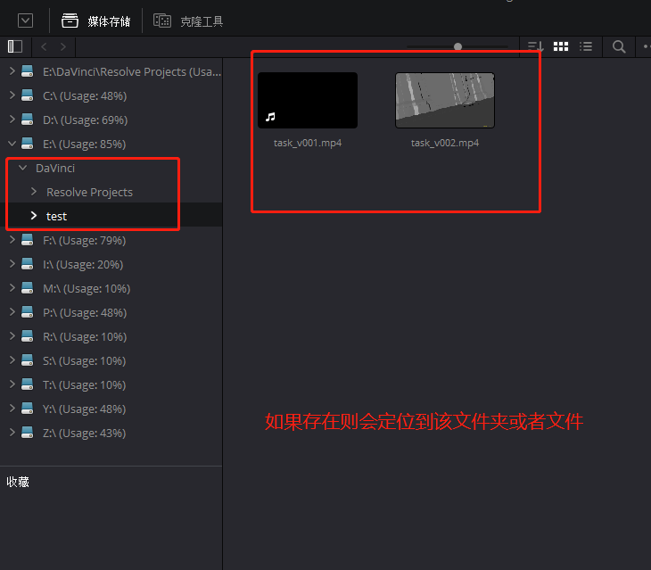

# MediaStorage对象

## 获取MediaStorage对象

| 方法                        | 说明                 |
|---------------------------|--------------------|
| Resolve.GetMediaStorage() | 获取 MediaStorage 对象 |

```python
import DaVinciResolveScript as dvr_script

resolve = dvr_script.scriptapp("Resolve")

# 获取 MediaStorage 对象
media_storage = resolve.GetMediaStorage()
```

## MediaStorage.GetMountedVolumeList()

- 返回 [paths...]

返回Resolve的媒体存储中显示的已装入卷相对应的文件夹路径列表。

```python
# return [paths...]
mounted_volume_list = media_storage.GetMountedVolumeList()
```

返回数据示例
```json
["E:\\DaVinci\\Resolve Projects", "C:\\", "D:\\", "E:\\", "F:\\", "I:\\", "M:\\", "P:\\", "R:\\", "S:\\", "T:\\", "Y:\\", "Z:\\"]
```

## MediaStorage.GetSubFolderList(folderPath)

- 返回 [paths...]

返回给定绝对文件夹路径中的文件夹路径列表。

```python
# return [paths...]
folder_list = media_storage.GetSubFolderList("E:\\DaVinci")
```

## MediaStorage.GetFileList(folderPath)

- 返回 [paths...]

返回给定绝对文件夹路径中的媒体和文件列表。请注意，媒体列表可能是逻辑合并的条目。

```python
# return [paths...]
file_list = media_storage.GetFileList("E:\\DaVinci\\test")
```

## MediaStorage.RevealInStorage(path)

- 返回 Bool

在Resolve的媒体存储中展开并显示给定的文件/文件夹路径。



```python
# return bool
res = media_storage.RevealInStorage("E:\\DaVinci\\test")

res = media_storage.RevealInStorage("E:\\DaVinci\\test\\task_v001.mp4")
```

## MediaStorage.AddItemListToMediaPool(item1, item2, ...)

- 返回 [clips...]

将指定的文件/文件夹路径从媒体存储添加到当前媒体池文件夹中。输入是一个或多个文件/文件夹路径,返回创建的 MediaPoolItems 对象列表。

```python
# return [paths...]
item_list = media_storage.AddItemListToMediaPool("E:\\DaVinci\\add_media\\test_add.mov")
item_list = media_storage.AddItemListToMediaPool("E:\\DaVinci\\add_media")
```

## MediaStorage.AddItemListToMediaPool([items...]) 

- 返回 [clips...]

将指定的文件/文件夹路径从媒体存储添加到当前媒体池文件夹中。输入是文件/文件夹路径的数组。返回创建的 MediaPoolItems 对象列表。

```python
# return [paths...]
item_list = media_storage.AddItemListToMediaPool(["E:\\DaVinci\\add_media\\test_add1.mov", "E:\\DaVinci\\add_media\\test_add2.mov"])
item_list = media_storage.AddItemListToMediaPool(["E:\\DaVinci\\add_media1", "E:\\DaVinci\\add_media2"])
```

## MediaStorage.AddClipMattesToMediaPool(MediaPoolItem, [paths], stereoEye)

- 返回 Bool

将指定的媒体文件添加为指定MediaPoolItem的蒙版。StereoEye是一个可选参数，用于指定为立体声剪辑（“左”或“右”）添加蒙版的眼睛。如果成功，则返回True。

```python
# return bool
project = project_manager.GetCurrentProject()
media_pool = project.GetMediaPool()
item_list = media_storage.AddItemListToMediaPool(["E:\\DaVinci\\add_media\\test_add1.mov", "E:\\DaVinci\\add_media\\test_add2.mov"])

if len(item_list) > 0:
    res = media_storage.AddClipMattesToMediaPool(item_list[0], ["E:\\DaVinci\\add_media\\test_add1.mov"], "left")
    print(res)
```

## MediaStorage.AddTimelineMattesToMediaPool([paths])

- 返回 [MediaPoolItems]

将指定的媒体文件添加为当前媒体池文件夹中的时间线蒙版。返回已创建的MediaPoolItems的列表。

```python
# return [MediaPoolItems]
media_pool_items = media_storage.AddTimelineMattesToMediaPool(["E:\\DaVinci\\add_media\\test_add1.mov"])
```
