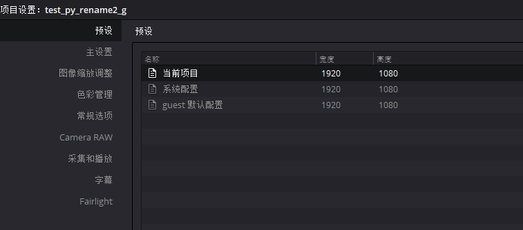
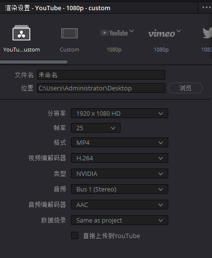

# Project对象

## 获取Project对象

| 方法                                        | 说明                  |
|-------------------------------------------|---------------------|
| ProjectManager.CreateProject(projectName) | 创建新项目返回 project 对象  |
| ProjectManager.LoadProject(projectName)   | 加载项目返回 project 对象   |
| ProjectManager.GetCurrentProject()        | 获取当前项目返回 project 对象 |

```python
import DaVinciResolveScript as dvr_script

resolve = dvr_script.scriptapp("Resolve")

# 获取 ProjectManager 对象
project_manager = resolve.GetProjectManager()

# 创建新项目返回 project 对象
project = project_manager.CreateProject("项目名称")

# 加载项目返回 project 对象
project = project_manager.LoadProject("项目名称")

# 获取当前项目返回 project 对象
project = project_manager.GetCurrentProject()

```

## Project.GetMediaPool()

- 返回 MediaPool 对象

返回媒体池对象。

```python
# return MediaPool object
media_pool = project.GetMediaPool()
```

## Project.GetTimelineCount()

- 返回时间线数数量 int 类型

返回项目中当前存在的时间线数。

```python
# return int
timeline_num = project.GetTimelineCount()
```

## Project.GetTimelineByIndex(idx)

- 返回 Timeline 对象

返回指定索引位置的时间线对象，索引 1 <= idx <= project.GetTimelineCount()。

```python
# return int
timeline = project.GetTimelineByIndex(1)
```

## Project.GetCurrentTimeline()

- 返回 Timeline 对象

返回当前加载的时间线。

```python
# return int
timeline = project.GetCurrentTimeline()
```

## Project.SetCurrentTimeline(timeline)

- 返回 Bool

将给定的时间线对象设置为项目的当前时间线。如果成功，则返回True。

```python
timeline = project.GetTimelineByIndex(1)
# return bool
res = project.SetCurrentTimeline(timeline)
```

## Project.GetGallery()

- 返回 Gallery 对象

返回调色模块画廊对象。


```python
# return Gallery object
gallery = project.GetGallery()
```

## Project.GetName()

- 返回 string 项目名称

返回当前项目对象的项目名称。

```python
# return string
project_name = project.GetName()
```

## Project.SetName(projectName)

- 返回 Bool

修改当前项目名称，如果给定的项目名称是唯一的则设置成功并返回 True，否则为 False。

```python
# return bool
res = project.SetName("test_py_rename2_g") 
```

## Project.GetPresetList()

- 返回 [presets...]

返回预设及其信息的列表。

```python
# return [presets...]
# [{'Name': 'Current Project', 'Width': 1920, 'Height': 1080}, {'Name': '系统配置', 'Width': 1920, 'Height': 1080}...]
preset_list = project.GetPresetList()
```

## Project.SetPreset(presetName)

- 返回 Bool

按给定的预设名称（字符串）将预设设置到项目中。



```python
# return bool
res = project.SetPreset("系统配置") 
```

## Project.AddRenderJob()

- 返回 string

将基于当前渲染设置的渲染作业添加到渲染队列。返回新渲染作业的唯一作业id（字符串）。


```python
# return string
job_id_str = project.AddRenderJob()
```

## Project.DeleteRenderJob(jobId)

- 返回 Bool

删除指定 jobId（字符串）的渲染作业。

```python
# return bool
res = project.DeleteRenderJob("987c99d8-7a58-4665-a2f8-37cf60f97b92") 
```

## Project.DeleteAllRenderJobs()

- 返回 Bool

删除队列中的所有渲染作业。

```python
# return bool
res = project.DeleteAllRenderJobs() 
```

## Project.GetRenderJobList()

- 返回 [render jobs...]

返回渲染作业及其信息的列表。

```python
# return [render jobs...]
render_job_list = project.GetRenderJobList() 
```

返回渲染作业数据字段

```json
{
  "JobId": "39dbf626-0eb5-4361-8ead-74ef3aa01ef8",
  "RenderJobName": "Job 1",
  "TimelineName": "分镜",
  "TargetDir": "C:\\Users\\Administrator\\Desktop",
  "IsExportVideo": "True",
  "IsExportAudio": "True",
  "FormatWidth": 1920,
  "FormatHeight": 1080,
  "FrameRate": "25",
  "PixelAspectRatio": 1,
  "MarkIn": 90000,
  "MarkOut": 93760,
  "AudioBitDepth": 16,
  "AudioSampleRate": 48000,
  "ExportAlpha": "False",
  "OutputFilename": "test.mp4",
  "RenderMode": "Single clip",
  "PresetName": "YouTube - 1080p",
  "VideoFormat": "MP4",
  "VideoCodec": "H.264 NVIDIA",
  "AudioCodec": "aac",
  "EncodingProfile": "",
  "MultiPassEncode": "False",
  "NetworkOptimization": "True"
}
```

## Project.GetRenderPresetList()

- 返回 [presets...]

返回渲染预设及其信息的列表。

```python
# return [presets...]
render_preset_list = project.GetRenderPresetList()
```

## Project.StartRendering(jobId1, jobId2, ...)

- 返回 Bool

开始渲染指定 jobId 的渲染作业。

```python
# return Bool
res = project.StartRendering("39dbf626-0eb5-4361-8ead-74ef3aa01ef8")
```

## Project.StartRendering([jobIds...], isInteractiveMode=False)

- 返回 Bool

开始渲染指定 jobId 的渲染作业。设置可选的“isInteractiveMode”后，可以在渲染期间在UI中启用错误反馈。

```python
# return Bool
res = project.StartRendering(["a365997d-37de-41a1-bdd3-101c86111a11"], False)
```

## Project.StartRendering(isInteractiveMode=False)

- 返回 Bool

开始渲染所有排队的渲染作业。设置可选的“isInteractiveMode”后，可以在渲染期间在UI中启用错误反馈。


```python
# return Bool
res = project.StartRendering(False)
```

## Project.StopRendering()

- 返回 None

停止当前所有渲染进程。


```python
# return None
project.StopRendering()
```

## Project.IsRenderingInProgress()

- 返回 Bool

如果正在进行渲染，则返回True。

```python
# return Bool
res = project.IsRenderingInProgress()
```

## Project.LoadRenderPreset(presetName)

- 返回 Bool

如果预设名称（字符串）存在，则将预设设置为渲染的当前预设。

> 配合 Project.GetRenderPresetList()  方法使用

```python
# return Bool
res = project.LoadRenderPreset("YouTube - 1080p")
```

## Project.SaveAsNewRenderPreset(presetName)

- 返回 Bool

如果预设名称（字符串）唯一，则按给定名称创建新的渲染预设。



```python
# return Bool
res = project.SaveAsNewRenderPreset("YouTube - 1080p - custom")
```

## Project.SetRenderSettings({settings})

- 返回 Bool

设置渲染产生

### 渲染设置参数说明

| 参数名                 | 类型        | 说明                                                                                                                                   |
|---------------------|-----------|--------------------------------------------------------------------------------------------------------------------------------------|
| SelectAllFrames     | Bool      | 选择所有帧范围，设置为True时将忽略“MarkIn”和“MarkOut”设置                                                                                              |
| MarkIn              | int       | 起始帧                                                                                                                                  |
| MarkOut             | int       | 结束帧                                                                                                                                  |
| TargetDir           | string    | 渲染目标文件夹                                                                                                                              |
| CustomName          | string    | 自定义文件名称                                                                                                                              |
| UniqueFilenameStyle | emun(0,1) | 唯一文件名样式，0为前缀，1为后缀                                                                                                                    |
| ExportVideo         | Bool      | 是否输出视频                                                                                                                               |
| ExportAudio         | Bool      | 是否输出音频                                                                                                                               |
| FormatWidth         | int       | 输出媒体宽度                                                                                                                               |
| FormatHeight        | int       | 输出媒体高度                                                                                                                               |
| FrameRate           | float     | 帧速率，例如：23.976, 24                                                                                                                    |
| PixelAspectRatio    | string    | 像素比，对于SD分辨率：“16_9”或“4_3”，其他分辨率：“square”或“cinemascope”                                                                                |
| VideoQuality        | mixed     | 0（整数）-将质量设置为自动 </br> [1->MAX]（int）-将设置输入比特率  </br>  ["Least", "Low", "Medium", "High", "Best"]（字符串）（“最小”、“低”、“中”、“高”、“最佳”）-将设置输入质量级别 |
| AudioCodec          | string    | 音频编码，例如 “aac”                                                                                                                        |
| AudioBitDepth       | int       | 比特率                                                                                                                                  |
| AudioSampleRate     | int       | 采样率                                                                                                                                  |
| ColorSpaceTag       | string    | 色彩空间标签，例如："Same as Project"（与项目相同）, "AstroDesign"                                                                                    |
| GammaTag            | string    | Gamma标签，例如："Same as Project"（与项目相同）, "ACEScct"                                                                                       |
| ExportAlpha         | Bool      | 是否导出 Alpha 通道                                                                                                                        |
| EncodingProfile     | string    | 编码配置文件，例如"Main10"，只能为H.264和H.265编码设置该参数。                                                                                             |
| MultiPassEncode     | Bool      | 是否多次编码，只能为H.264设置该参数。                                                                                                                |
| AlphaMode           | emun(0,1) | Alpha通道模式，0为Premultipled、1为Straight。只有当ExportAlpha参数为True是才起作用                                                                       |
| NetworkOptimization | Bool      | 是否启用网络优化，仅支持QuickTime和MP4格式。                                                                                                         |

```python
# return Bool
res = project.SetRenderSettings({"CustomName": "test_render_file_name"})
```

## Project.GetRenderJobStatus(jobId)

- 返回 {status info}

返回一个dict，其中包含作业状态和给定作业ID（字符串）的作业完成百分比。

> 可以轮询监听该方法来做渲染结果通知功能，例如通知到钉钉或者企业微信

```python
# return {status info}
res = project.GetRenderJobStatus("64b77004-425b-4809-9a89-3e561bf48326")
```
返回数据示例

```json
{
    "JobStatus":"已取消",
    "CompletionPercentage":7
}
```

## Project.GetSetting(settingName)

- 返回 string

返回项目设置的值（通过输入的 settingName、字符串类型）。

> 这个 Key 值还没找到哪里能看全

```python
# return Bool
res = project.GetSetting("timelineFrameRate")
```

## Project.SetSetting(settingName, settingValue)

- 返回 Bool

设项目设置指定 settingName 的值为指定的 settingValue。

> 这个 Key 值还没找到哪里能看全

```python
# return Bool
res = project.SetSetting("superScale", 3)
```

## Project.GetRenderFormats()

- 返回 {render formats..}

返回所有可用渲染的格式（格式->文件扩展名）。

```python
# return {render formats..}
render_format_list = project.GetRenderFormats()
```

返回数据
```json
{
    "AVI":"avi",
    "BRAW":"braw",
    "Cineon":"cin",
    "DCP":"dcp",
    "DPX":"dpx",
    "EXR":"exr",
    "IMF":"imf",
    "JPEG 2000":"j2c",
    "MJ2":"mj2",
    "MKV":"mkv",
    "MP4":"mp4",
    "MTS":"mts",
    "MXF OP-Atom":"mxf",
    "MXF OP1A":"mxf_op1a",
    "Panasonic AVC":"pavc",
    "QuickTime":"mov",
    "TIFF":"tif",
    "Wave":"wav"
}
```

## Project.GetRenderCodecs(renderFormat)

- 返回 {render codecs...}

返回给定渲染格式（字符串）的可用编解码器（编解码器描述->编解码器名称）。

```python
# return {render codecs..}
render_format_codecs_list = project.GetRenderCodecs("EXR")
```

返回数据
```json
{
    "RGB float (DWAA Compression)":"RGBFloatDWAA",
    "RGB float (DWAB Compression)":"RGBFloatDWAB",
    "RGB float (No Compression)":"RGBFloat",
    "RGB float (PIZ Compression)":"RGBFloatPIZ",
    "RGB float (RLE Compression)":"RGBFloatRLE",
    "RGB float (ZIP Compression)":"RGBFloatZIP",
    "RGB half (DWAA Compression)":"RGBHalfDWAA",
    "RGB half (DWAB Compression)":"RGBHalfDWAB",
    "RGB half (No Compression)":"RGBHalf",
    "RGB half (PIZ Compression)":"RGBHalfPIZ",
    "RGB half (RLE Compression)":"RGBHalfRLE",
    "RGB half (ZIP Compression)":"RGBHalfZIP"
}
```

## Project.GetCurrentRenderFormatAndCodec()

- 返回 {format, codec}

返回当前所选项目格式和编码信息。

```python
# return {format, codec}
res = project.GetCurrentRenderFormatAndCodec()
```

## Project.SetCurrentRenderFormatAndCodec(format, codec)

- 返回 Bool

将给定的渲染格式（字符串）和渲染编解码器（字符串）设置为渲染选项。

```python
# return bool
res = project.SetCurrentRenderFormatAndCodec("mp4", "H265_NVIDIA")
```

## Project.GetCurrentRenderMode()

- 返回 int

返回渲染模式：0-多个单独片段，1-单个片段。

```python
# return int
res = project.GetCurrentRenderMode()
```

## Project.SetCurrentRenderMode(renderMode) 

- 返回 Bool

设置渲染模式：0-多个单独片段，1-单个片段。

```python
# return bool
res = project.SetCurrentRenderMode(1)
```

## Project.GetRenderResolutions(format, codec) 

- 返回 [{Resolution}]

返回适用于给定渲染格式（字符串）和渲染编解码器（字符串）的分辨率列表。如果未提供参数，则返回完整的分辨率列表。

```python
# return [{Resolution}]
resolution_list = project.GetRenderResolutions("mp4", "H265_NVIDIA")
```

## Project.RefreshLUTList() 

- 返回 Bool

刷新 LUT 列表

```python
# return bool
res = project.RefreshLUTList()
```
