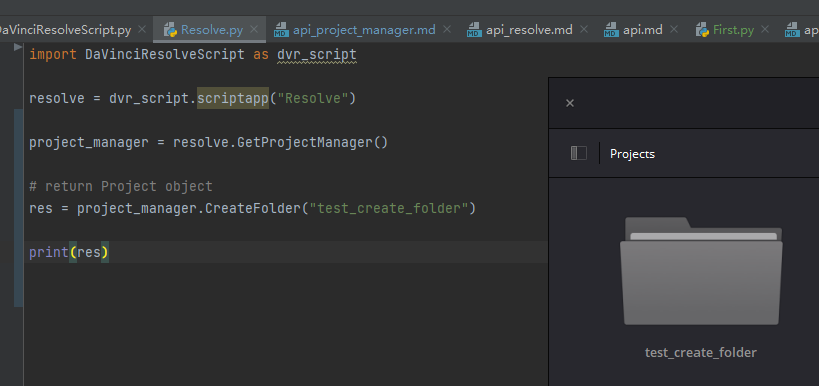

# ProjectManager对象

## 获取ProjectManager对象

| 方法                          | 说明            |
|-----------------------------|---------------|
| Resolve.GetProjectManager() | 通过Resolve对象获取 |

```python
import DaVinciResolveScript as dvr_script

resolve = dvr_script.scriptapp("Resolve")

project_manager = resolve.GetProjectManager()
```

## ProjectManager.CreateProject(projectName)

- 返回 Project 对象 或 None

创建项目，如果项目名称（字符串）唯一则创建并返回项目对象，不唯一则返回None。

```python
# return Project object
project = project_manager.CreateProject("test_project")

# 进入指定文件夹下面创建项目，那么当前这个项目就在 test_create_folder 这个文件夹下面
project_manager.OpenFolder("test_create_folder")
project = project_manager.CreateProject("test_level1_project")
```

## ProjectManager.DeleteProject(projectName)

- 返回 Bool

删除当前文件夹下面的指定项目名的项目，注意只能删除当前未加载的项目。

```python
# return bool
res = project_manager.DeleteProject("test_project2")
```

## ProjectManager.LoadProject(projectName)

- 返回 Project 对象 或 None

加载指定项目名项目，如果存在指定项目名称（字符串）则返回项目对象，不存在返回None。

```python
# return Project object
project = project_manager.LoadProject("test_project2")
```

## ProjectManager.GetCurrentProject()

- 返回 Project

获取当前加载的项目对象。

```python
# return Project object
project = project_manager.GetCurrentProject()
```

## ProjectManager.SaveProject()

- 返回 Bool

使用自己的名称保存当前加载的项目。如果成功，则返回True。

```python
# return bool
project = project_manager.SaveProject()
```

## ProjectManager.CloseProject(project)

- 返回 Bool

> project 传参为 Project 对象？

关闭指定的项目而不保存。

```python
# return bool
project = project_manager.GetCurrentProject()
res = project_manager.CloseProject(project)
```

## ProjectManager.CreateFolder(folderName)

- 返回 Bool

创建文件夹，文件夹名称必须唯一且不存在。可以通过文件夹给项目分组。



```python
# return bool
res = project_manager.CreateFolder("test_create_folder")

# 可以通过下面形式创建多级文件夹，或者给某个文件夹下面创建子文件夹
project_manager.CreateFolder("test_create_folder/test_level1/test_level2")
```

## ProjectManager.DeleteFolder(folderName)

- 返回 Bool

删除指定的文件夹（如果存在）。如果成功则返回True。

> 注意当文件夹下面存在项目该文件夹是无法被删除的，需要先删除下面项目才能删除改文件夹

```python
# return bool
project_manager.DeleteFolder("test_level1")
```

## ProjectManager.GetProjectListInCurrentFolder()

- 返回 [project names...]
- 
返回当前文件夹中项目名称的列表。

```python
# return [project names...]
project_list = project_manager.GetProjectListInCurrentFolder()
```

## ProjectManager.GetFolderListInCurrentFolder()

- 返回 [folder names...]

返回当前文件夹中文件夹名称的列表

```python
# return [folder names...]
folder_list = project_manager.GetFolderListInCurrentFolder()
```

## ProjectManager.GotoRootFolder()

- 返回 Bool

打开数据库中的根文件夹。

```python
# return bool
project_manager.GotoRootFolder()
```

## ProjectManager.GotoParentFolder()

- 返回 Bool

如果当前文件夹有父文件夹，则打开数据库中当前文件夹的父文件夹。

```python
# return bool
project_manager.GotoParentFolder()
```

## ProjectManager.GetCurrentFolder()

- 返回 string

返回当前文件夹名称。

```python
# return string
folder_name = project_manager.GetCurrentFolder()
```

## ProjectManager.OpenFolder(folderName)

- 返回 string

以给定名称打开文件夹。

```python
# return string
# 打开 test_create_folder/test_level1 多层文件需要一层一层打开，这里可以自己封装下函数
project_manager.OpenFolder("test_create_folder")
project_manager.OpenFolder("test_level1")
```

## ProjectManager.ImportProject(filePath)

- 返回 Bool

从提供的文件路径导入项目，如果成功则返回True。

> 注意项目会被导入到当前所在文件夹目录，项目不会被加载仅仅被导入进来。

```python
# return bool
project_manager.ImportProject("D:/dafenqi/test_export/test_py_rename2.drp")
```

## ProjectManager.ExportProject(projectName, filePath, withStillsAndLUTs=True)

- 返回 Bool

将项目导出到提供的文件路径，包括静帧和LUT（如果WithStillsAndLUT为True 默认情况下启用）。如果成功则返回True。

> filePath 如果最后文件名没有加 .drp 后缀，软件会自动填充

```python
# return bool
project_manager.ExportProject("test_py_rename", "D:/dafenqi/test_export/test_py_rename2.drp", True)
```

## ProjectManager.RestoreProject(filePath)

- 返回 Bool

从提供的文件路径恢复项目，如果成功则返回True。

```python
# return bool
project_manager.RestoreProject("D:/dafenqi/test_export/test_py_rename2.drp")
```

## ProjectManager.GetCurrentDatabase()

- 返回 {dbInfo}

返回与当前数据库连接对应的字典（带有键“DbType”、“DbName”和可选的“IpAddress”）。

```python
# return {'DbType': 'Disk', 'DbName': 'Local Database'}
project_manager.GetCurrentDatabase()
```

## ProjectManager.GetDatabaseList()

- 返回 [{dbInfo}]

返回与添加到解析的所有数据库相对应的字典项列表（带有键“DbType”、“DbName”和可选的“IpAddress”）

```python
# return [{'DbType': 'Disk', 'DbName': 'Local Database'}]
project_manager.GetCurrentDatabase()
```

## ProjectManager.SetCurrentDatabase({dbInfo})

- 返回 Bool

将当前数据库连接切换到以下键指定的数据库，并关闭任何打开的项目。

| 参数名       | 字段类型   | 说明                                             |
|-----------|--------|------------------------------------------------|
| DbType    | string | 数据库类型 'Disk' 或者 'PostgreSQL'                   |
| DbName    | string | 数据库名                                           |
| IpAddress | string | PostgreSQL server的IP地址（字符串，可选键-默认为“127.0.0.1”） |

```python
# return bool
project_manager.SetCurrentDatabase({'DbType': 'Disk', 'DbName': 'Local Database'})
```