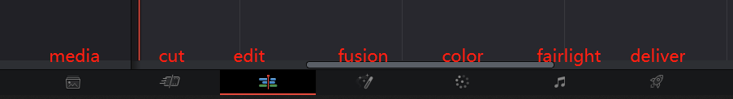
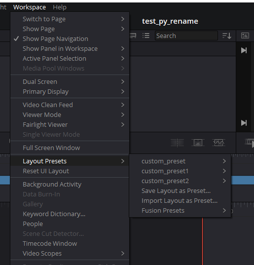

# Resolve对象

## Resolve.Fusion()

- 返回 Fusion 对象

返回 Fusion 对象，是Fusion脚本起点。

> 该对象主要是开发Fusion模块相关功能，不是本手册关注重点！

```python
import DaVinciResolveScript as dvr_script

resolve = dvr_script.scriptapp("Resolve")

# return Fusion object
fusion = resolve.Fusion()
```

## Resolve.GetMediaStorage()

- 返回 MediaStorage 对象

返回要查询和处理媒体存储位置的 MediaStorage 对象。

```python
import DaVinciResolveScript as dvr_script

resolve = dvr_script.scriptapp("Resolve")

# return MediaStorage object
media_storage = resolve.GetMediaStorage()
```

## Resolve.GetProjectManager()

- 返回 ProjectManager 对象

返回当前打开的数据库的项目管理器对象。

```python
import DaVinciResolveScript as dvr_script

resolve = dvr_script.scriptapp("Resolve")

# return ProjectManager object
project_manager = resolve.GetProjectManager()
```

## Resolve.OpenPage(pageName)

- 返回 Bool

切换DaVinci Resolve下面功能页面，pageName 参数可以使用 "media", "cut", "edit", "fusion", "color", "fairlight", "deliver" 之一。



```python
import DaVinciResolveScript as dvr_script

resolve = dvr_script.scriptapp("Resolve")

# return Bool
resolve.OpenPage("cut")
```

## Resolve.GetCurrentPage()

- 返回 String

返回当前在主窗口中显示的页面，返回值可以是 "media", "cut", "edit", "fusion", "color", "fairlight", "deliver", None。


```python
import DaVinciResolveScript as dvr_script

resolve = dvr_script.scriptapp("Resolve")

# return String
page = resolve.GetCurrentPage()
```

## Resolve.GetProductName()

- 返回 String

返回产品名称，DaVinci Resolve 或者 DaVinci Resolve Studio。

```python
import DaVinciResolveScript as dvr_script

resolve = dvr_script.scriptapp("Resolve")

# return String
product_name = resolve.GetProductName()
```

## Resolve.GetVersion()

- 返回 [version fields]

返回[major、minor、patch、build、suffix]格式的产品版本字段列表。如：[17, 4, 3, 10, '']。

```python
import DaVinciResolveScript as dvr_script

resolve = dvr_script.scriptapp("Resolve")

# return List
product_version_list = resolve.GetVersion()
```

## Resolve.GetVersionString()

- 返回 String

返回以“major.minor.patch[suffix].build”格式产品版本。如：17.4.3.10。

```python
import DaVinciResolveScript as dvr_script

resolve = dvr_script.scriptapp("Resolve")

# return String
product_version_string = resolve.GetVersionString()
```

## Resolve.LoadLayoutPreset(presetName)

- 返回 Bool

从名为“presetName”的已保存预设加载UI布局。



```python
import DaVinciResolveScript as dvr_script

resolve = dvr_script.scriptapp("Resolve")

# return Bool
resolve.LoadLayoutPreset("custom_preset")
```

## Resolve.UpdateLayoutPreset(presetName)

- 返回 Bool

用当前UI布局覆盖名为“presetName”的预设。

```python
import DaVinciResolveScript as dvr_script

resolve = dvr_script.scriptapp("Resolve")

# return Bool
resolve.UpdateLayoutPreset("custom_preset")
```

## Resolve.ExportLayoutPreset(presetName, presetFilePath)

- 返回 Bool

将名为“presetName”的预设导出到路径“presetFilePath”。

```python
import DaVinciResolveScript as dvr_script

resolve = dvr_script.scriptapp("Resolve")

# return Bool
resolve.ExportLayoutPreset("custom_preset2", "D:/davinci-resolve-dev/preset_file/custom_preset2.preset")
```

## Resolve.DeleteLayoutPreset(presetName)

- 返回 Bool

删除名为“presetName”的预设。

```python
import DaVinciResolveScript as dvr_script

resolve = dvr_script.scriptapp("Resolve")

# return Bool
resolve.DeleteLayoutPreset("custom_preset2")
```

## Resolve.SaveLayoutPreset(presetName)

- 返回 Bool

将当前UI布局保存为名为“presetName”的预设。

> 主要不能重复保存，第一次存完后，下次更新调用 UpdateLayoutPreset 方法

```python
import DaVinciResolveScript as dvr_script

resolve = dvr_script.scriptapp("Resolve")

# return Bool
resolve.SaveLayoutPreset("custom_preset2")
```

## Resolve.ImportLayoutPreset(presetFilePath, presetName)

- 返回 Bool

从路径“presetFilePath”导入预设。可选参数“presetName”指定如何命名预设。如果未指定，则根据文件名命名预设。

> 不能重复导入

```python
import DaVinciResolveScript as dvr_script

resolve = dvr_script.scriptapp("Resolve")

# return Bool
res = resolve.ImportLayoutPreset("D:/davinci-resolve-dev/preset_file/custom_preset2.preset", "custom_preset2")
```

## Resolve.Quit()

- 返回 Bool

退出 Resolve 应用程序。

```python
import DaVinciResolveScript as dvr_script

resolve = dvr_script.scriptapp("Resolve")

resolve.Quit()
```
