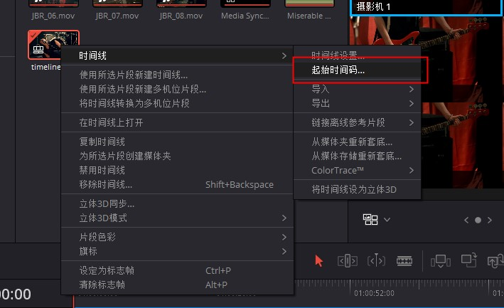
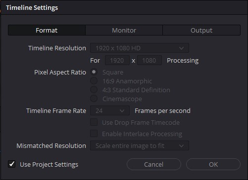
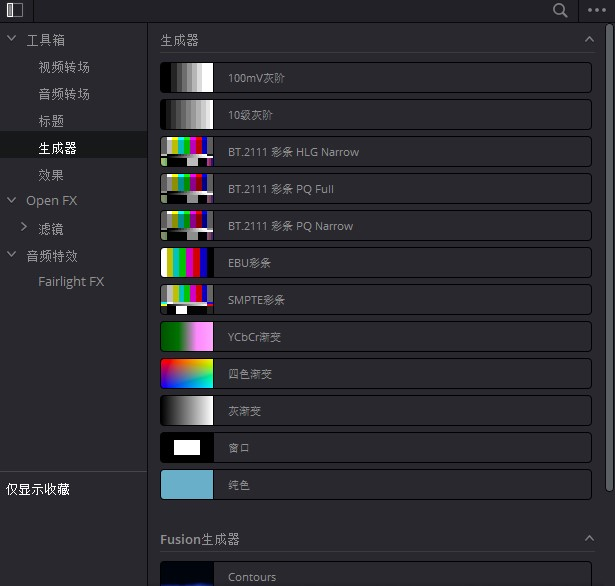

# Timeline对象

## 获取Timeline对象

| 方法                                                          | 说明                |
|-------------------------------------------------------------|-------------------|
| Project.GetTimelineByIndex(idx)                             | 通过索引号获取时间线对象      |
| Project.GetCurrentTimeline()                                | 获取当前激活的时间线对象      |
| MediaPool.CreateEmptyTimeline(name)                         | 媒体池创建空时间线，返回时间线对象 |
| MediaPool.CreateTimelineFromClips(name, clip1, clip2,...)   | 媒体池创建时间线，返回时间线对象  |
| MediaPool.CreateTimelineFromClips(name, [clips])            | 媒体池创建时间线，返回时间线对象  |
| MediaPool.CreateTimelineFromClips(name, [{clipInfo}])       | 媒体池创建时间线，返回时间线对象  |
| MediaPool.ImportTimelineFromFile(filePath, {importOptions}) | 媒体池导入时间线，返回时间线对象  |
| Timeline.DuplicateTimeline(timelineName)                    | 复制时间线，返回时间线对象     |

```python
import DaVinciResolveScript as dvr_script

resolve = dvr_script.scriptapp("Resolve")

# 获取 ProjectManager 对象
project_manager = resolve.GetProjectManager()

# 获取当前项目返回 project 对象
project = project_manager.GetCurrentProject()

# 获取 Timeline 对象
timeline = project.GetCurrentTimeline()
```

## Timeline.GetName()

- 返回 string

返回当前时间线的名称。

```python
# return string
timeline_name = timeline.GetName()
```

## Timeline.SetName(timelineName)

- 返回 Bool

设置当前时间线的名称，名称需要唯一，如果成功返回 True 反之 False。

```python
# return string
res = timeline.SetName("timeline_new_name")
```

## Timeline.GetStartFrame()

- 返回 int

获取当前时间线开始帧数。



```python
# return int
start_frame_number = timeline.GetStartFrame()
```

## Timeline.GetEndFrame()

- 返回 int

获取当前时间线结束帧数。

```python
# return int
end_frame_number = timeline.GetEndFrame()
```

## Timeline.GetTrackCount(trackType)

- 返回 int

获取当前时间线对象上指定类型轨道的数量。

| 类型       | 说明  |
|----------|-----|
| audio    | 音频  |
| video    | 视频  |
| subtitle | 字幕  |

```python
# return int
audio_track_count = timeline.GetTrackCount("audio")
video_track_count = timeline.GetTrackCount("video")
subtitle_track_count = timeline.GetTrackCount("subtitle")
```

## Timeline.GetItemListInTrack(trackType, index)

- 返回 [items...]

获取当前时间线指定类型（audio，video，subtitle）和指定轨道索引（index 从1开始）的所有 TimelineItem 对象。

```python
# return [items...]
first_video_track_items = timeline.GetItemListInTrack("video", 1)
```

## Timeline.AddMarker(frameId, color, name, note, duration, customData)

- 返回 Bool

给指定时间线范围增加标记点数据。

| 参数         | 说明                                                                                                                                                             |
|------------|----------------------------------------------------------------------------------------------------------------------------------------------------------------|
| frameId    | 起始帧，单位为帧                                                                                                                                                       |
| color      | 颜色 蓝色（Blue）,青色（Cyan），绿色（Green），黄色（Yellow），红色（Red），粉色（Pink），紫色（Purple），紫红（Fuchsia），玫红（Rose），淡紫（Lavender），淡蓝（Sky），亮绿（Mint），亮黄（Lemon），金色（Sand），深棕（Sand），乳白（Cream） |
| name       | 标记名称                                                                                                                                                           |
| note       | 标记描述                                                                                                                                                           |
| duration   | 标记持续时间，单位为帧                                                                                                                                                    |
| customData | 自定义数据，字符串类型，可以写入json字符串                                                                                                                                        |

```python
# return Bool
res = timeline.AddMarker(100.0, "Green", "marker_name", "marker_note", 100.0, "test_custom_data")

data = [{'id': 111, 'assets': 'long', 'time_log': 3}]
json_str = json.dumps(data)
res = timeline.AddMarker(100.0, "Sky", "marker_name", "marker_note", 100.0, json_str)
```

## Timeline.GetMarkers()

- 返回 {markers...}

返回当前时间线所有标记点字典，格式为(frameId -> {information})

```python
# return Bool
markers = timeline.GetMarkers()
# {100: {'color': 'Sky', 'duration': 100, 'note': 'marker_note', 'name': 'marker_name', 'customData': '[{"id": 111, "assets": "long", "time_log": 3}]'}}
```

## Timeline.GetMarkerByCustomData(customData)

- 返回 {markers...}

返回具有指定customData的第一个匹配的标记点数据{information}。

```python
# return Bool
markers = timeline.GetMarkerByCustomData()
```

## Timeline.UpdateMarkerCustomData(frameId, customData)

- 返回 Bool

更新给定frameId位置处标记的customData（字符串）。CustomData不通过UI公开，对于脚本开发人员将任何特定于用户的数据附加到标记很有用。

```python
# return Bool

data = [{'id': 111, 'assets': 'long', 'time_log': 3}]
json_str = json.dumps(data)
res = timeline.UpdateMarkerCustomData(100.0, json_str)
```

## Timeline.GetMarkerCustomData(frameId)

- 返回 string

返回给定frameId位置处标记的customData字符串。

```python
# return string
customData = timeline.GetMarkerCustomData(100.0)
```

## Timeline.DeleteMarkersByColor(color)

- 返回 Bool

删除指定颜色的所有时间线标记。支持“All”参数并删除所有时间线标记。

| 参数       | 说明         |
|----------|------------|
| All      | 删除所有标记点    | 
| Blue     | 删除所有蓝色标记点  | 
| Cyan     | 删除所有青色标记点  | 
| Green    | 删除所有绿色标记点  | 
| Yellow   | 删除所有黄色标记点  | 
| Red      | 删除所有红色标记点  | 
| Pink     | 删除所有粉色标记点  | 
| Purple   | 删除所有紫色标记点  | 
| Fuchsia  | 删除所有紫红色标记点 | 
| Rose     | 删除所有玫红色标记点 | 
| Lavender | 删除所有淡紫色标记点 | 
| Sky      | 删除所有淡蓝色标记点 | 
| Mint     | 删除所有亮绿色标记点 | 
| Lemon    | 删除所有亮黄色标记点 | 
| Sand     | 删除所有金色色标记点 | 
| Sand     | 删除所有深棕色标记点 | 
| Cream    | 删除所有乳白色标记点 | 

```python
# return Bool
res = timeline.DeleteMarkersByColor("All")
```

## Timeline.DeleteMarkerAtFrame(frameNum)

- 返回 Bool

删除给定帧编号处的时间线标记。

```python
# return Bool
res = timeline.DeleteMarkerAtFrame(86400)
```

## Timeline.DeleteMarkerByCustomData(customData)

- 返回 Bool

删除具有指定customData的第一个匹配标记。

```python
# return Bool
res = timeline.DeleteMarkerByCustomData("test_tag2")
```

## Timeline.ApplyGradeFromDRX(path, gradeMode, item1, item2, ...)
## Timeline.ApplyGradeFromDRX(path, gradeMode, item1, [items])

- 返回 Bool

从指定的文件路径，加载 .drx 格式调色预设，应用于指定的时间线项目。

| gradeMode参数 | 说明     |
|-------------|--------|
| 0           | 无关键帧   | 
| 1           | 源时间码对齐 | 
| 2           | 开始帧对齐  | 

```python
# return Bool
res = timeline.ApplyGradeFromDRX("./grade.drx", 0, item1)
res = timeline.ApplyGradeFromDRX("./grade.drx", 0, [items])
```

## Timeline.GetCurrentTimecode()

- 返回 string

在“Cut”、“Edit”、“Color”、“Fairlight” 和 “Deliver” 页面上，返回当前播放指针位置的字符串时间码表示形式。

```python
# return string
current_timeline_code = timeline.GetCurrentTimecode()
```

## Timeline.SetCurrentTimecode(timecode)

- 返回 Bool

根据“Cut”、“Edit”、“Color”、“Fairlight”和“Deliver”页面的输入时间代码设置当前播放指针位置。

```python
# return Bool
res = timeline.SetCurrentTimecode("01:00:20:00")
```

## Timeline.GetCurrentVideoItem()

- 返回 item

返回视频时间线当前指针位置视频对象。

```python
# return item
current_video_item = timeline.GetCurrentVideoItem()
```

## Timeline.GetCurrentClipThumbnailImage()

- 返回 {thumbnailData}

返回一个字典（键“width”、“height”、“format”和“data”），其数据包含"Color"页面中当前媒体的原始缩略图图像数据（以base64格式编码的RGB 8位图像数据）。

```python
# return {thumbnailData}
current_clipThumbnail = timeline.GetCurrentClipThumbnailImage()
```

## Timeline.GetTrackName(trackType, trackIndex) 

- 返回 string

返回指定轨道类型和轨道索引的轨道名称

| trackType参数 | 说明   |
|-------------|------|
| audio       | 音频轨道 | 
| video       | 视频轨道 | 
| subtitle    | 字幕轨道 | 

| trackIndex参数             | 说明                                                |
|--------------------------|---------------------------------------------------|
| 1                        | 起始索引值                                             | 
| GetTrackCount(trackType) | 最大索引值 1 <= trackIndex <= GetTrackCount(trackType) |

```python
# return string
track_name = timeline.GetTrackName("video", 1)
```

## Timeline.SetTrackName(trackType, trackIndex, name) 

- 返回 Bool

设置指定轨道类型和轨道索引的轨道名称

| trackType参数 | 说明   |
|-------------|------|
| audio       | 音频轨道 | 
| video       | 视频轨道 | 
| subtitle    | 字幕轨道 | 

| trackIndex参数             | 说明                                                |
|--------------------------|---------------------------------------------------|
| 1                        | 起始索引值                                             | 
| GetTrackCount(trackType) | 最大索引值 1 <= trackIndex <= GetTrackCount(trackType) |

```python
# return Bool
res = timeline.SetTrackName("video", 1, "新视频")
```

## Timeline.DuplicateTimeline(timelineName)

- 返回 timeline 对象

复制时间线，并在成功时返回创建的时间线，timelineName为可选参数,不填写timelineName默认复制当前时间线。

```python
# return timeline
new_timeline = timeline.DuplicateTimeline()
new_timeline = timeline.DuplicateTimeline("old_timeline")
```

## Timeline.CreateCompoundClip([timelineItems], {clipInfo})

- 返回 timelineItem 对象

使用指定的时间线项和剪辑信息创建复合剪辑。

| clipInfo参数    | 说明     |
|---------------|--------|
| startTimecode | 起始时间码  | 
| name          | 复合剪辑名称 |

```python
# return timelineItem
compound_clip = timeline.CreateCompoundClip([timelineItems], {"startTimecode" : "00:00:00:00", "name" : "Compound Clip 1"})
```

## Timeline.CreateFusionClip([timelineItems])

- 返回 timelineItem 对象

使用指定的时间线项创建Fusion剪辑。

```python
# return timelineItem
fusion_clip = timeline.CreateFusionClip([timelineItems])
```

## Timeline.ImportIntoTimeline(filePath, {importOptions})

- 返回 Bool

将指定的 AAF 文件导入时间线,支持以下导入importOptions参数。

| 健名                                          | 类型     | 说明                                                                         |
|---------------------------------------------|--------|----------------------------------------------------------------------------|
| autoImportSourceClipsIntoMediaPool          | Bool   | 指定是否应将源剪辑导入媒体池，默认为True                                                     | 
| ignoreFileExtensionsWhenMatching            | Bool   | 指定匹配时是否应忽略文件扩展名，默认为False                                                   | 
| linkToSourceCameraFiles                     | Bool   | 指定是否应启用指向源摄像机文件的链接，默认为False                                                |
| useSizingInfo                               | Bool   | 指定是否应使用大小调整信息，默认为False                                                     |
| importMultiChannelAudioTracksAsLinkedGroups | Bool   | 指定是否应将多声道音频曲目作为链接组导入，默认为False                                              |
| insertAdditionalTracks                      | Bool   | 指定是否应插入其他曲目，默认为True                                                        |
| insertWithOffset                            | string | 以时间码格式指定带偏移值的插入-默认为“00:00:00:00”，如果“insertAdditionalTracks”为False则适用       |
| sourceClipsPath                             | string | 如果媒体在其原始路径中不可访问，并且“ignoreFileExtensionsWhenMatching”为True，则指定要搜索源剪辑的文件系统路径 |
| sourceClipsFolders                          | string | 如果当前文件夹中不存在媒体，要搜索源剪辑的媒体池文件夹对象列表                                            |

```python
# return Bool
res = timeline.ImportIntoTimeline("./xxx.aaf", {"autoImportSourceClipsIntoMediaPool": True})
```

## Timeline.Export(fileName, exportType, exportSubtype)

- 返回 Bool

导出当前时间线到指定文件路径。

| exportType参数                        | exportSubtype参数(可选)          |
|-------------------------------------|------------------------------|
| resolve.EXPORT_AAF                  | resolve.EXPORT_AAF_NEW       |
| resolve.EXPORT_AAF                  | resolve.EXPORT_AAF_EXISTING  |
| resolve.EXPORT_DRT                  | resolve.EXPORT_NONE          |
| resolve.EXPORT_EDL                  | resolve.EXPORT_NONE          |
| resolve.EXPORT_EDL                  | resolve.EXPORT_CDL           |
| resolve.EXPORT_EDL                  | resolve.EXPORT_SDL           |
| resolve.EXPORT_EDL                  | resolve.EXPORT_MISSING_CLIPS |
| resolve.EXPORT_FCP_7_XML            | resolve.EXPORT_NONE          |
| resolve.EXPORT_FCPXML_1_3           | resolve.EXPORT_NONE          |
| resolve.EXPORT_FCPXML_1_4           | resolve.EXPORT_NONE          |
| resolve.EXPORT_FCPXML_1_5           | resolve.EXPORT_NONE          |
| resolve.EXPORT_FCPXML_1_6           | resolve.EXPORT_NONE          |
| resolve.EXPORT_FCPXML_1_7           | resolve.EXPORT_NONE          |
| resolve.EXPORT_FCPXML_1_8           | resolve.EXPORT_NONE          |
| resolve.EXPORT_HDR_10_PROFILE_A     | resolve.EXPORT_NONE          |
| resolve.EXPORT_HDR_10_PROFILE_B     | resolve.EXPORT_NONE          |
| resolve.EXPORT_TEXT_CSV             | resolve.EXPORT_NONE          |
| resolve.EXPORT_TEXT_TAB             | resolve.EXPORT_NONE          |
| resolve.EXPORT_DOLBY_VISION_VER_2_9 | resolve.EXPORT_NONE          |
| resolve.EXPORT_DOLBY_VISION_VER_4_0 | resolve.EXPORT_NONE          |

```python
# return Bool
res = timeline.Export("D:/dafenqi/test_export/test_py_rename2.aaf", resolve.EXPORT_AAF, resolve.EXPORT_NONE)
```

## Timeline.GetSetting(settingName)

- 返回 string

返回时间线设置的值, settingName可选,不填返回全部参数。

参数名参考



```json
{
	'audioCaptureNumChannels': '2',
	'audioOutputHasTimecode': '0',
	'audioPlayoutNumChannels': '2',
	'colorAcesGamutCompressType': 'None',
	'colorAcesIDT': 'No Input Transform',
	'colorAcesNodeLUTProcessingSpace': 'acesccAp1',
	'colorAcesODT': 'No Output Transform',
	'colorGalleryStillsLocation': 'E:\\DaVinci\\Resolve Projects\\.gallery',
	'colorGalleryStillsNamingCustomPattern': '',
	'colorGalleryStillsNamingEnabled': '0',
	'colorGalleryStillsNamingPattern': 'clipName',
	'colorGalleryStillsNamingWithStillNumber': 'off',
	'colorKeyframeDynamicsEndProfile': '1',
	'colorKeyframeDynamicsStartProfile': '1',
	'colorLuminanceMixerDefaultZero': '0',
	'colorScienceMode': 'davinciYRGB',
	'colorSpaceInput': 'Rec.709 Gamma 2.4',
	'colorSpaceInputGamma': '',
	'colorSpaceOutput': 'Rec.709 Gamma 2.4',
	'colorSpaceOutputGamma': '',
	'colorSpaceOutputGamutMapping': 'None',
	'colorSpaceOutputGamutSaturationKnee': '0.9',
	'colorSpaceOutputGamutSaturationMax': '1',
	'colorSpaceOutputToneLuminanceMax': '100',
	'colorSpaceOutputToneMapping': 'None',
	'colorSpaceTimeline': 'Rec.709 Gamma 2.4',
	'colorSpaceTimelineGamma': '',
	'colorUseBGRPixelOrderForDPX': '0',
	'colorUseContrastSCurve': '1',
	'colorUseLegacyLogGrades': '2',
	'colorUseLocalVersionsAsDefault': '1',
	'colorUseStereoConvergenceForEffects': '0',
	'colorVersion10Name': '',
	'colorVersion1Name': '',
	'colorVersion2Name': '',
	'colorVersion3Name': '',
	'colorVersion4Name': '',
	'colorVersion5Name': '',
	'colorVersion6Name': '',
	'colorVersion7Name': '',
	'colorVersion8Name': '',
	'colorVersion9Name': '',
	'graphicsWhiteLevel': '100',
	'hdr10PlusControlsOn': '0',
	'hdrDolbyControlsOn': '0',
	'hdrDolbyMasterDisplay': '',
	'hdrDolbyVersion': '4.0',
	'hdrMasteringLuminanceMax': '1000',
	'hdrMasteringOn': '0',
	'imageDeinterlaceQuality': 'normal',
	'imageEnableFieldProcessing': '0',
	'imageMotionEstimationMode': 'standardFaster',
	'imageMotionEstimationRange': 'medium',
	'imageResizeMode': 'sharper',
	'imageResizingGamma': 'Timeline',
	'imageRetimeInterpolation': 'nearest',
	'inputDRT': 'None',
	'inputDRTSatRolloffLimit': '10000',
	'inputDRTSatRolloffStart': '100',
	'isAutoColorManage': '0',
	'limitAudioMeterAlignLevel': '0',
	'limitAudioMeterDisplayMode': 'post_fader',
	'limitAudioMeterHighLevel': '-5',
	'limitAudioMeterLUFS': '-23',
	'limitAudioMeterLoudnessScale': 'ebu_9_scale',
	'limitAudioMeterLowLevel': '-10',
	'limitBroadcastSafeLevels': '20_120',
	'limitBroadcastSafeOn': '0',
	'limitSubtitleCPL': '60',
	'limitSubtitleCaptionDurationSec': '3',
	'outputDRT': 'None',
	'outputDRTSatRolloffLimit': '10000',
	'outputDRTSatRolloffStart': '100',
	'perfAutoRenderCacheAfterTime': '5',
	'perfAutoRenderCacheComposite': '0',
	'perfAutoRenderCacheEnable': '1',
	'perfAutoRenderCacheFuEffect': '1',
	'perfAutoRenderCacheTransition': '0',
	'perfCacheClipsLocation': 'CacheClip',
	'perfOptimisedCodec': 'dnxhd_hqx_12b',
	'perfOptimisedMediaOn': '1',
	'perfOptimizedResolutionRatio': 'auto',
	'perfProxyMediaOn': '1',
	'perfProxyResolutionRatio': 'original',
	'perfRenderCacheCodec': 'dnxhd_hqx_12b',
	'perfRenderCacheMode': 'user',
	'rcmPresetMode': 'Custom',
	'separateColorSpaceAndGamma': '0',
	'superScaleNoiseReduction': 'Medium',
	'superScaleSharpness': 'Medium',
	'timelineDropFrameTimecode': '0',
	'timelineFrameRate': 24.0,
	'timelineFrameRateMismatchBehavior': 'resolve',
	'timelineInputResMismatchBehavior': 'scaleToFit',
	'timelineInputResMismatchCustomPreset': 'None',
	'timelineInputResMismatchUseCustomPreset': '0',
	'timelineInterlaceProcessing': '0',
	'timelineOutputPixelAspectRatio': 'square',
	'timelineOutputResMatchTimelineRes': '1',
	'timelineOutputResMismatchBehavior': 'scaleToFit',
	'timelineOutputResMismatchCustomPreset': 'None',
	'timelineOutputResMismatchUseCustomPreset': '0',
	'timelineOutputResolutionHeight': '1080',
	'timelineOutputResolutionWidth': '1920',
	'timelinePixelAspectRatio': 'square',
	'timelinePlaybackFrameRate': '24',
	'timelineResolutionHeight': '1080',
	'timelineResolutionWidth': '1920',
	'timelineSaveThumbsInProject': '0',
	'timelineWorkingLuminance': '1000',
	'timelineWorkingLuminanceMode': 'HDR 1000',
	'useCATransform': '0',
	'useColorSpaceAwareGradingTools': '0',
	'useInverseDRT': '0',
	'videoCaptureCodec': '',
	'videoCaptureFormat': '',
	'videoCaptureIngestHandles': '0',
	'videoCaptureLocation': 'E:\\DaVinci\\Resolve Projects\\Capture',
	'videoCaptureMode': 'video_audio',
	'videoDataLevels': 'Video',
	'videoDataLevelsRetainSubblockAndSuperWhiteData': '0',
	'videoDeckAdd32Pulldown': '0',
	'videoDeckBitDepth': '10',
	'videoDeckFormat': 'HD 1080PsF 24',
	'videoDeckNonAutoEditFrames': '0',
	'videoDeckOutputSyncSource': 'auto',
	'videoDeckPrerollSec': '5',
	'videoDeckSDIConfiguration': 'none',
	'videoDeckUse444SDI': '0',
	'videoDeckUseAudoEdit': '1',
	'videoDeckUseStereoSDI': '0',
	'videoMonitorBitDepth': '10',
	'videoMonitorFormat': 'HD 1080p 24',
	'videoMonitorMatrixOverrideFor422SDI': 'Rec.601',
	'videoMonitorSDIConfiguration': 'dual_link',
	'videoMonitorScaling': 'bilinear',
	'videoMonitorUse444SDI': '0',
	'videoMonitorUseHDROverHDMI': '0',
	'videoMonitorUseLevelA': '0',
	'videoMonitorUseMatrixOverrideFor422SDI': '0',
	'videoMonitorUseStereoSDI': '0',
	'videoPlayoutAudioFramesOffset': '0',
	'videoPlayoutBatchHeadDuration': '8',
	'videoPlayoutBatchTailDuration': '8',
	'videoPlayoutLTCFramesOffset': '0',
	'videoPlayoutMode': 'video_audio',
	'videoPlayoutShowLTC': '0',
	'videoPlayoutShowSourceTimecode': '0',
	'superScale': 1
}
```

```python
# return string
# 返回全部参数
timeline_resolution = timeline.GetSetting()
# 返回指定参数
timeline_resolution = timeline.GetSetting("audioCaptureNumChannels")
```


## Timeline.SetSetting(settingName, settingValue) 

- 返回 Bool

设置时间线设置的值, settingName参数名和settingValue参数类型参考上面。

```python
# return Bool
res = timeline.SetSetting("timelineFrameRate", 25.0)
```


## Timeline.InsertGeneratorIntoTimeline(generatorName)

- 返回 TimelineItem

添加指定生成器效果到时间线。



```python
# return TimelineItem

#-- 起作用
timeline.InsertGeneratorIntoTimeline("10 Step")
timeline.InsertGeneratorIntoTimeline("100mV Steps")
timeline.InsertGeneratorIntoTimeline("EBU Color Bar")
timeline.InsertGeneratorIntoTimeline("Four Color Gradient")
timeline.InsertGeneratorIntoTimeline("Grey Scale")
timeline.InsertGeneratorIntoTimeline("SMPTE Color Bar")
timeline.InsertGeneratorIntoTimeline("Solid Color")
timeline.InsertGeneratorIntoTimeline("Window")
timeline.InsertGeneratorIntoTimeline("YCbCr Ramp")

#-- 不起作用
timeline.InsertGeneratorIntoTimeline("BT.2111 Color Bar HLG Narrow")
timeline.InsertGeneratorIntoTimeline("BT.2111 Color Bar PQ Full")
timeline.InsertGeneratorIntoTimeline("BT.2111 Color Bar PQ Narrow")
```

## Timeline.InsertFusionGeneratorIntoTimeline(generatorName)

- 返回 TimelineItem

添加指定Fusion生成器效果到时间线。

>测试不起作用不知道怎么使用

```python
# return TimelineItem
#-- 不起作用
timeline.InsertFusionGeneratorIntoTimeline("Contours")
timeline.InsertFusionGeneratorIntoTimeline("Noise Gradient")
timeline.InsertFusionGeneratorIntoTimeline("Paper")
timeline.InsertFusionGeneratorIntoTimeline("Texture Background")
```

## Timeline.InsertOFXGeneratorIntoTimeline(generatorName)

- 返回 TimelineItem

添加指定OFX生成器效果到时间线。

>不知道怎么使用

```python
# return TimelineItem
#-- 不起作用
```

## Timeline.InsertTitleIntoTimeline(titleName)

- 返回 TimelineItem

将标题插入时间线。

```python
# return TimelineItem
timeline.InsertTitleIntoTimeline("Left Lower Third")
timeline.InsertTitleIntoTimeline("Middle Lower Third")
timeline.InsertTitleIntoTimeline("Right Lower Third")
timeline.InsertTitleIntoTimeline("Scroll")
timeline.InsertTitleIntoTimeline("Text")
```


## Timeline.InsertFusionTitleIntoTimeline(titleName)

- 返回 TimelineItem

将Fusion标题插入时间线。

>测试不起作用不知道怎么使用

```python
# return TimelineItem
# -- 不起作用
timeline.InsertFusionTitleIntoTimeline("Background Reveal")
timeline.InsertFusionTitleIntoTimeline("Background Reveal Lower Third")
timeline.InsertFusionTitleIntoTimeline("Call Out")
timeline.InsertFusionTitleIntoTimeline("Center Reveal")
timeline.InsertFusionTitleIntoTimeline("Clean and Simple")
timeline.InsertFusionTitleIntoTimeline("Clean and Simple Heading Lower Third")
timeline.InsertFusionTitleIntoTimeline("Clean and Simple Lower Third")
timeline.InsertFusionTitleIntoTimeline("Dark Box Text")
timeline.InsertFusionTitleIntoTimeline("Dark Box Text Lower Third")
timeline.InsertFusionTitleIntoTimeline("Digital Glitch")
timeline.InsertFusionTitleIntoTimeline("Digital Glitch Lower Third")
timeline.InsertFusionTitleIntoTimeline("Digital Glitch Right Side")
timeline.InsertFusionTitleIntoTimeline("Draw On 2 Lines Lower Third")
timeline.InsertFusionTitleIntoTimeline("Draw On Corners 1 Line")
timeline.InsertFusionTitleIntoTimeline("Drop In")
timeline.InsertFusionTitleIntoTimeline("Drop In Lower Third")
timeline.InsertFusionTitleIntoTimeline("Fade On")
timeline.InsertFusionTitleIntoTimeline("Fade On Lower Third")
timeline.InsertFusionTitleIntoTimeline("Fade On Right Side")
timeline.InsertFusionTitleIntoTimeline("Flip Over")
timeline.InsertFusionTitleIntoTimeline("Flip Over Lower Third")
timeline.InsertFusionTitleIntoTimeline("Flip Up")
timeline.InsertFusionTitleIntoTimeline("Flip Up Lower Third")
timeline.InsertFusionTitleIntoTimeline("Horizontal Line Reveal")
timeline.InsertFusionTitleIntoTimeline("Horizontal Slide")
timeline.InsertFusionTitleIntoTimeline("Jitter")
timeline.InsertFusionTitleIntoTimeline("Jitter Lower Third")
timeline.InsertFusionTitleIntoTimeline("Long Title")
timeline.InsertFusionTitleIntoTimeline("Long Title Lower Third")
timeline.InsertFusionTitleIntoTimeline("Outline Offset")
timeline.InsertFusionTitleIntoTimeline("Random Write On")
timeline.InsertFusionTitleIntoTimeline("Random Write On Lower Third")
timeline.InsertFusionTitleIntoTimeline("Rise Fade")
timeline.InsertFusionTitleIntoTimeline("Rotate In and Out")
timeline.InsertFusionTitleIntoTimeline("Scale Up")
timeline.InsertFusionTitleIntoTimeline("Scale Up Lower Third")
timeline.InsertFusionTitleIntoTimeline("Simple Box 1 Line Lower Third")
timeline.InsertFusionTitleIntoTimeline("Simple Box 2 Lines Lower Third")
timeline.InsertFusionTitleIntoTimeline("Simple Box Thin 1 Line Lower Third")
timeline.InsertFusionTitleIntoTimeline("Simple Underline Lower Third")
timeline.InsertFusionTitleIntoTimeline("Slide From Center Line")
timeline.InsertFusionTitleIntoTimeline("Slide In and Down")
timeline.InsertFusionTitleIntoTimeline("Slide In and Scroll")
timeline.InsertFusionTitleIntoTimeline("Slide In and Scroll Lower Third")
timeline.InsertFusionTitleIntoTimeline("Spin Twist Drift")
timeline.InsertFusionTitleIntoTimeline("Stretch Zoom")
timeline.InsertFusionTitleIntoTimeline("Superhero Movie")
timeline.InsertFusionTitleIntoTimeline("Text Box")
timeline.InsertFusionTitleIntoTimeline("Text Box Swipe In")
timeline.InsertFusionTitleIntoTimeline("Text Box Swipe In Lower Third")
timeline.InsertFusionTitleIntoTimeline("Text Over Shape")
timeline.InsertFusionTitleIntoTimeline("Text Over Shape Lower Third")
timeline.InsertFusionTitleIntoTimeline("Text Ripple")
timeline.InsertFusionTitleIntoTimeline("Three Line Drop")
timeline.InsertFusionTitleIntoTimeline("Title Dramatic Mood")
timeline.InsertFusionTitleIntoTimeline("Vertical Reveal")
timeline.InsertFusionTitleIntoTimeline("Vertical Reveal Lower Third")
timeline.InsertFusionTitleIntoTimeline("Vertical Slide")
timeline.InsertFusionTitleIntoTimeline("Vertical Slide Lower Third")
timeline.InsertFusionTitleIntoTimeline("Zipper")
```

## Timeline.GrabStill()

- 返回 galleryStill 对象

从当前视频剪辑中抓取静止图像。返回GalleryStill对象。

```python
# return galleryStill
gallery_still = timeline.GrabStill()
```

## Timeline.GrabAllStills(stillFrameSource)

- 返回 [galleryStill] 对象

从时间线的所有剪辑中抓取静态图像。返回GalleryStill对象的列表。

| stillFrameSource参数 | 说明     |
|--------------------|--------|
| 1                  | 第一帧  | 
| 2                  | 中间帧 |

```python
# return [galleryStill] 
gallery_stills = timeline.GrabAllStills(1)
```


