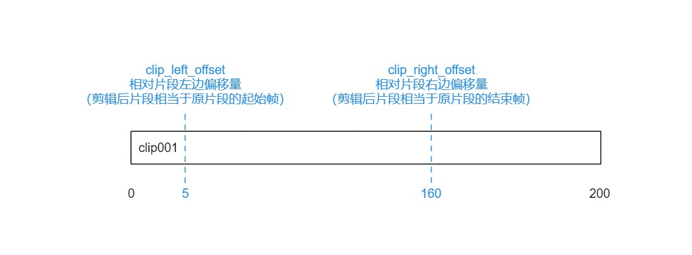
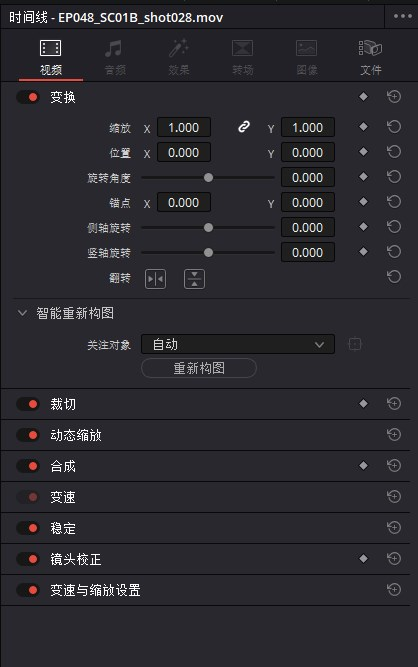

# TimelineItem对象

## 获取TimelineItem对象

| 方法                                                       | 说明                   |
|----------------------------------------------------------|----------------------|
| Timeline.CreateCompoundClip([timelineItems], {clipInfo}) | 返回 TimelineItem 对象   |
| Timeline.CreateFusionClip([timelineItems])               | 返回 TimelineItem 对象   |
| GetItemListInTrack(trackType, index)                     | 返回 TimelineItem 对象列表 |
| GetCurrentVideoItem()                                    | 返回 TimelineItem 对象   |
| InsertGeneratorIntoTimeline(generatorName)               | 返回 TimelineItem 对象   |
| InsertFusionGeneratorIntoTimeline(generatorName))        | 返回 TimelineItem 对象   |
| InsertOFXGeneratorIntoTimeline(generatorName)            | 返回 TimelineItem 对象   |
| InsertTitleIntoTimeline(titleName)                       | 返回 TimelineItem 对象   |
| InsertFusionTitleIntoTimeline(titleName)                 | 返回 TimelineItem 对象   |

```python
import DaVinciResolveScript as dvr_script

resolve = dvr_script.scriptapp("Resolve")

# 获取 ProjectManager 对象
project_manager = resolve.GetProjectManager()

# 获取当前项目返回 project 对象
project = project_manager.GetCurrentProject()

# 获取当前激活的时间线
timeline = project.GetCurrentTimeline()

# 获取当前时间线video类型的轨道数量
track_count = timeline.GetTrackCount('video')

# 按索引选择指定的视频轨1
video_track_items = timeline.GetItemListInTrack('video', 1)
```

## TimelineItem.GetName()

- 返回 string

返回时间线项对象名称。

```python
# return string
timeline_item = timeline.GetCurrentVideoItem() 
item_name = timeline_item.GetName()
```

## TimelineItem.GetDuration()

- 返回 int

返回时间线项对象持续时间。

```python
# return int
timeline_item = timeline.GetCurrentVideoItem() 
item_duration = timeline_item.GetDuration()
```

## TimelineItem.GetEnd()

- 返回 int

返回时间线项对象时间线上的结束帧位置。

```python
# return int
timeline_item = timeline.GetCurrentVideoItem() 
item_end_frame = timeline_item.GetEnd()
```

## TimelineItem.GetFusionCompCount()

- 返回 int

返回与时间线项目关联的Fusion合成数。

```python
# return int
timeline_item = timeline.GetCurrentVideoItem() 
fusion_comp_count = timeline_item.GetFusionCompCount()
```

## TimelineItem.GetFusionCompByIndex(compIndex)

- 返回 fusionComp

返回基于给定索引的Fusion合成对象。1<=compIndex<=timelineItem.GetFusionCompCount()。

```python
# return fusionComp
timeline_item = timeline.GetCurrentVideoItem() 
fusion_comp_obj = timeline_item.GetFusionCompByIndex(1)
```

## TimelineItem.GetFusionCompNameList()

- 返回 [names...]

返回与时间线项目关联的Fusion合成名称的列表。

```python
# return [names...]
timeline_item = timeline.GetCurrentVideoItem() 
fusion_comp_name_list = timeline_item.GetFusionCompNameList()
```

## TimelineItem.GetFusionCompByName(compName)

- 返回 fusionComp

返回基于给定名称的Fusion合成对象。

```python
# return fusionComp
timeline_item = timeline.GetCurrentVideoItem() 
fusion_comp_obj = timeline_item.GetFusionCompByName('test')
```

## TimelineItem.GetLeftOffset()

- 返回 int

返回相对片段左边偏移量（剪辑后片段相当于原片段的起始帧）

```python
# return int
timeline_item = timeline.GetCurrentVideoItem() 
item_left_offset = timeline_item.GetLeftOffset()
```



## TimelineItem.GetRightOffset()

- 返回 int

相对片段右边偏移量（剪辑后片段相当于原片段的结束帧）

```python
# return int
timeline_item = timeline.GetCurrentVideoItem() 
item_right_offset = timeline_item.GetRightOffset()
```

## TimelineItem.GetStart()

- 返回 int

返回时间线项对象在时间线上的开始帧位置。

```python
# return int
timeline_item = timeline.GetCurrentVideoItem() 
item_start_frame = timeline_item.GetStart()
```

## TimelineItem.SetProperty(propertyKey, propertyValue)

- 返回 Bool

将属性“propertyKey”的值设置为值“propertyValue”

```python
# return Bool
timeline_item = timeline.GetCurrentVideoItem() 
res = timeline_item.SetProperty('Pan', '4.0*width')
```

## TimelineItem.GetProperty(propertyKey)

- 返回 int/[key:value]

返回指定键的值，如果没有指定键，该方法将为所有支持的键返回字典（python）或表（lua）

```python
# return int/[key:value]
timeline_item = timeline.GetCurrentVideoItem() 
res = timeline_item.GetProperty('Pan')
```

> 下面介绍函数“TimelineItem:SetProperty”和“TimelineItems:GetProperty”的附加注释。这些函数用于获取和设置提到的属性。



| 属性名              | 属性说明         | 属性值范围                                                                                                                                                                                                                                                                                                                                                                                                                                                                                                                                                                                                                                                                                                                  |
|------------------|--------------|------------------------------------------------------------------------------------------------------------------------------------------------------------------------------------------------------------------------------------------------------------------------------------------------------------------------------------------------------------------------------------------------------------------------------------------------------------------------------------------------------------------------------------------------------------------------------------------------------------------------------------------------------------------------------------------------------------------------|
| Pan              | 画面左右平移       | 浮点类型值，值范围为  -4.0*width 到 4.0*width，例如画面尺寸1920*1080，那么可以偏移范围为 -7680 到 7680                                                                                                                                                                                                                                                                                                                                                                                                                                                                                                                                                                                                                                              |
| Tilt             | 画面上下平移       | 浮点类型值，值范围为  -4.0*height 到 4.0*height，例如画面尺寸1920*1080，那么可以偏移范围为 -4320 到 4320                                                                                                                                                                                                                                                                                                                                                                                                                                                                                                                                                                                                                                            |
| ZoomX            | 为x轴缩放画面      | 浮点类型值，值范围为 0.0 到 100.0                                                                                                                                                                                                                                                                                                                                                                                                                                                                                                                                                                                                                                                                                                 |
| ZoomY            | 为Y轴缩放画面      | 浮点类型值，值范围为 0.0 到 100.0                                                                                                                                                                                                                                                                                                                                                                                                                                                                                                                                                                                                                                                                                                 |
| ZoomGang         | 不知道干啥的       | 布尔值                                                                                                                                                                                                                                                                                                                                                                                                                                                                                                                                                                                                                                                                                                                    |
| RotationAngle    | 旋转角度         | 浮点类型值，值范围为 -360.0 到 360.0                                                                                                                                                                                                                                                                                                                                                                                                                                                                                                                                                                                                                                                                                              |
| AnchorPointX     | 锚点水平移动       | 浮点类型值，值范围为  -4.0*width 到 4.0*width，例如画面尺寸1920*1080，那么可以偏移范围为 -7680 到 7680                                                                                                                                                                                                                                                                                                                                                                                                                                                                                                                                                                                                                                              |
| AnchorPointY     | 锚点上下移动       | 浮点类型值，值范围为  -4.0*height 到 4.0*height，例如画面尺寸1920*1080，那么可以偏移范围为 -4320 到 4320                                                                                                                                                                                                                                                                                                                                                                                                                                                                                                                                                                                                                                            |
| Pitch            | 侧轴旋转         | 浮点类型值，值范围为 -1.5 到 1.5                                                                                                                                                                                                                                                                                                                                                                                                                                                                                                                                                                                                                                                                                                  |
| Yaw              | 竖轴旋转         | 浮点类型值，值范围为 -1.5 到 1.5                                                                                                                                                                                                                                                                                                                                                                                                                                                                                                                                                                                                                                                                                                  |
| FlipX            | 画面水平翻转       | 布尔值                                                                                                                                                                                                                                                                                                                                                                                                                                                                                                                                                                                                                                                                                                                    |
| FlipY            | 画面垂直翻转       | 布尔值                                                                                                                                                                                                                                                                                                                                                                                                                                                                                                                                                                                                                                                                                                                    |
| CropLeft         | 画面左侧裁切       | 浮点类型值，值范围 0.0 到 width ，例如画面尺寸1920*1080，那么值范围 0.0 到 1920                                                                                                                                                                                                                                                                                                                                                                                                                                                                                                                                                                                                                                                                |
| CropRight        | 画面右侧裁切       | 浮点类型值，值范围 0.0 到 width ，例如画面尺寸1920*1080，那么值范围 0.0 到 1920                                                                                                                                                                                                                                                                                                                                                                                                                                                                                                                                                                                                                                                                |
| CropTop          | 画面上侧裁切       | 浮点类型值，值范围 0.0 到 height ，例如画面尺寸1920*1080，那么值范围 0.0 到 1080                                                                                                                                                                                                                                                                                                                                                                                                                                                                                                                                                                                                                                                               |
| CropBottom       | 画面下侧裁切       | 浮点类型值，值范围 0.0 到 height ，例如画面尺寸1920*1080，那么值范围 0.0 到 1080                                                                                                                                                                                                                                                                                                                                                                                                                                                                                                                                                                                                                                                               |
| CropSoftness     | 边缘羽化         | 浮点类型值，值范围 -100 到 100                                                                                                                                                                                                                                                                                                                                                                                                                                                                                                                                                                                                                                                                                                   |
| CropRetain       | 保留图像位置的复选框的值 | 布尔值                                                                                                                                                                                                                                                                                                                                                                                                                                                                                                                                                                                                                                                                                                                    |
| DynamicZoomEase  | 动态缩放         | 以下常量中的值： DYNAMIC_ZOOM_EASE_LINEAR = 0 、DYNAMIC_ZOOM_EASE_IN = 1 、 DYNAMIC_ZOOM_EASE_OUT = 2、 DYNAMIC_ZOOM_EASE_IN_AND_OUT = 3                                                                                                                                                                                                                                                                                                                                                                                                                                                                                                                                                                                          |
| CompositeMode    | 合成模式         | 以下常量中的值：COMPOSITE_NORMAL = 0、COMPOSITE_ADD=1、COMPOSITE_SUBTRACT=2、COMPOSITE_DIFF=3、COMPOSITE_MULTIPLY=4、COMPOSITE_SCREEN=5、COMPOSITE_OVERLAY=6、COMPOSITE_HARDLIGHT=7、COMPOSITE_SOFTLIGHT=8、COMPOSITE_DARKEN=9、COMPOSITE_LIGHTEN=10、COMPOSITE_COLOR_DODGE=11、COMPOSITE_COLOR_BURN=12、COMPOSITE_HUE=13、COMPOSITE_SATURATE=14、COMPOSITE_COLORIZE=15、COMPOSITE_LUMA_MASK=16、COMPOSITE_DIVIDE=17、COMPOSITE_LINEAR_DODGE=18、COMPOSITE_LINEAR_BURN=19、COMPOSITE_LINEAR_LIGHT=20、COMPOSITE_VIVID_LIGHT=21、COMPOSITE_PIN_LIGHT=22、COMPOSITE_HARD_MIX=23、COMPOSITE_LIGHTER_COLOR=24、COMPOSITE_DARKER_COLOR=25、COMPOSITE_FOREGROUND=26、COMPOSITE_ALPHA=27、COMPOSITE_INVERTED_ALPHA=28、COMPOSITE_LUM=29、 COMPOSITE_INVERTED_LUM=30 |
| Opacity          | 透明值          | 浮点类型值，值范围 0.0 to 100.0                                                                                                                                                                                                                                                                                                                                                                                                                                                                                                                                                                                                                                                                                                 |
| Distortion       | 镜头畸变校正       | 浮点类型值，值范围 -1.0 to 1.0                                                                                                                                                                                                                                                                                                                                                                                                                                                                                                                                                                                                                                                                                                  |
| RetimeProcess    | 变速处理         | 以下常量中的值：RETIME_USE_PROJECT = 0、RETIME_NEAREST = 1、RETIME_FRAME_BLEND = 2、RETIME_OPTICAL_FLOW = 3                                                                                                                                                                                                                                                                                                                                                                                                                                                                                                                                                                                                                       |
| MotionEstimation | 运动估计         | 以下常量中的值：MOTION_EST_USE_PROJECT = 0、MOTION_EST_STANDARD_FASTER = 1、MOTION_EST_STANDARD_BETTER = 2、MOTION_EST_ENHANCED_FASTER = 3、MOTION_EST_ENHANCED_BETTER = 4、MOTION_EST_SPEED_WRAP = 5                                                                                                                                                                                                                                                                                                                                                                                                                                                                                                                               |
| Scaling          | 缩放比例         | 以下常量中的值： SCALE_USE_PRODUCT = 0、SCALE_CROP = 1、SCALE_FIT = 2、SCALE_FILL = 3、SCALE_STRETCH = 4                                                                                                                                                                                                                                                                                                                                                                                                                                                                                                                                                                                                                           |
| ResizeFilter     | 缩放过滤器        | 以下常量中的值： RESIZE_FILTER_USE_FILTER = 0、RESIZE_FILTER_SHARPER = 1、RESIZE_FILTER_SMOOTHER = 2、RESIZE_FILTER_BICUBIC = 3、RESIZE_FILTER_BILINEAR = 4、RESIZE_FILTER_BESSEL = 5、RESIZE_FILTER_BOX = 6、RESIZE_FILTER_CATMULL_ROM = 7、RESIZE_FILTER_CUBIC = 8、RESIZE_FILTER_GAUSSIAN = 9、RESIZE_FILTER_LANCZOS = 10、RESIZE_FILTER_MITCHELL = 11、RESIZE_FILTER_NEAREST_NEIGHBOR = 12、RESIZE_FILTER_QUADRATIC = 13、RESIZE_FILTER_SINC = 14、RESIZE_FILTER_LINEAR = 15                                                                                                                                                                                                                                                              |


## TimelineItem.AddMarker(frameId, color, name, note, duration, customData)

- 返回 Bool

给指定时间线范围增加标记点数据。

| 参数         | 说明                                                                                                                                                             |
|------------|----------------------------------------------------------------------------------------------------------------------------------------------------------------|
| frameId    | 起始帧，单位为帧                                                                                                                                                       |
| color      | 颜色 蓝色（Blue）,青色（Cyan），绿色（Green），黄色（Yellow），红色（Red），粉色（Pink），紫色（Purple），紫红（Fuchsia），玫红（Rose），淡紫（Lavender），淡蓝（Sky），亮绿（Mint），亮黄（Lemon），金色（Sand），深棕（Sand），乳白（Cream） |
| name       | 标记名称                                                                                                                                                           |
| note       | 标记描述                                                                                                                                                           |
| duration   | 标记持续时间，单位为帧                                                                                                                                                    |
| customData | 自定义数据，字符串类型，可以写入json字符串                                                                                                                                        |

```python
# return Bool
res = timeline_item.AddMarker(100.0, "Green", "marker_name", "marker_note", 100.0, "test_custom_data")

data = [{'id': 111, 'assets': 'long', 'time_log': 3}]
json_str = json.dumps(data)
res = timeline_item.AddMarker(100.0, "Sky", "marker_name", "marker_note", 100.0, json_str)
```

## TimelineItem.GetMarkers()

- 返回 {markers...}

返回当前时间线所有标记点字典，格式为(frameId -> {information})

```python
# return Bool
markers = timeline_item.GetMarkers()
# {100: {'color': 'Sky', 'duration': 100, 'note': 'marker_note', 'name': 'marker_name', 'customData': '[{"id": 111, "assets": "long", "time_log": 3}]'}}
```

## TimelineItem.GetMarkerByCustomData(customData)

- 返回 {markers...}

返回具有指定customData的第一个匹配的标记点数据{information}。

```python
# return Bool
markers = timeline_item.GetMarkerByCustomData()
```

## TimelineItem.UpdateMarkerCustomData(frameId, customData)

- 返回 Bool

更新给定frameId位置处标记的customData（字符串）。CustomData不通过UI公开，对于脚本开发人员将任何特定于用户的数据附加到标记很有用。

```python
# return Bool

data = [{'id': 111, 'assets': 'long', 'time_log': 3}]
json_str = json.dumps(data)
res = timeline_item.UpdateMarkerCustomData(100.0, json_str)
```

## TimelineItem.GetMarkerCustomData(frameId)

- 返回 string

返回给定frameId位置处标记的customData字符串。

```python
# return string
customData = timeline_item.GetMarkerCustomData(100.0)
```

## TimelineItem.DeleteMarkersByColor(color)

- 返回 Bool

删除指定颜色的所有时间线标记。支持“All”参数并删除所有时间线标记。

| 参数       | 说明         |
|----------|------------|
| All      | 删除所有标记点    | 
| Blue     | 删除所有蓝色标记点  | 
| Cyan     | 删除所有青色标记点  | 
| Green    | 删除所有绿色标记点  | 
| Yellow   | 删除所有黄色标记点  | 
| Red      | 删除所有红色标记点  | 
| Pink     | 删除所有粉色标记点  | 
| Purple   | 删除所有紫色标记点  | 
| Fuchsia  | 删除所有紫红色标记点 | 
| Rose     | 删除所有玫红色标记点 | 
| Lavender | 删除所有淡紫色标记点 | 
| Sky      | 删除所有淡蓝色标记点 | 
| Mint     | 删除所有亮绿色标记点 | 
| Lemon    | 删除所有亮黄色标记点 | 
| Sand     | 删除所有金色色标记点 | 
| Sand     | 删除所有深棕色标记点 | 
| Cream    | 删除所有乳白色标记点 | 

```python
# return Bool
res = timeline_item.DeleteMarkersByColor("All")
```

## TimelineItem.DeleteMarkerAtFrame(frameNum)

- 返回 Bool

删除给定帧编号处的时间线标记。

```python
# return Bool
res = timeline_item.DeleteMarkerAtFrame(86400)
```

## TimelineItem.DeleteMarkerByCustomData(customData)

- 返回 Bool

删除具有指定customData的第一个匹配标记。

```python
# return Bool
res = timeline_item.DeleteMarkerByCustomData("test_tag2")
```